# FluidX3D

The fastest and most memory efficient lattice Boltzmann CFD software, running on all GPUs and CPUs via [OpenCL](https://github.com/ProjectPhysX/OpenCL-Wrapper "OpenCL-Wrapper"). Free for non-commercial use.

<a href="https://youtu.be/-MkRBeQkLk8"></img></a><a href="https://youtu.be/1z5-ddsmAag"></img></a><br>
<a href="https://youtu.be/2BPP1oWzvi0"></img></a><a href="https://youtu.be/K5eKxzklXDA"></img></a>
(click on images to show videos on YouTube)

<details><summary>Update History</summary>

- [v1.0](https://github.com/ProjectPhysX/FluidX3D/releases/tag/v1.0) (04.08.2022) [changes](https://github.com/ProjectPhysX/FluidX3D/commit/768073501af725e392a4b85885009e2fa6400e48) (public release)
  - public release
- [v1.1](https://github.com/ProjectPhysX/FluidX3D/releases/tag/v1.1) (29.09.2022) [changes](https://github.com/ProjectPhysX/FluidX3D/compare/v1.0...v1.1) (GPU voxelization)
  - added solid voxelization on GPU (slow algorithm)
  - added tool to print current camera position (key <kbd>G</kbd>)
  - minor bug fix (workaround for Intel iGPU driver bug with triangle rendering)
- [v1.2](https://github.com/ProjectPhysX/FluidX3D/releases/tag/v1.2) (24.10.2022) [changes](https://github.com/ProjectPhysX/FluidX3D/compare/v1.1...v1.2) (force/torque computation)
  - added functions to compute force/torque on objects
  - added function to translate Mesh
  - added Stokes drag validation setup
- [v1.3](https://github.com/ProjectPhysX/FluidX3D/releases/tag/v1.3) (10.11.2022) [changes](https://github.com/ProjectPhysX/FluidX3D/compare/v1.2...v1.3) (minor bug fixes)
  - added unit conversion functions for torque
  - `FORCE_FIELD` and `VOLUME_FORCE` can now be used independently
  - minor bug fix (workaround for AMD legacy driver bug with binary number literals)
- [v1.4](https://github.com/ProjectPhysX/FluidX3D/releases/tag/v1.4) (14.12.2022) [changes](https://github.com/ProjectPhysX/FluidX3D/compare/v1.3...v1.4) (Linux graphics)
  - complete rewrite of C++ graphics library to minimize API dependencies
  - added interactive graphics mode on Linux with X11
  - fixed streamline visualization bug in 2D
- [v2.0](https://github.com/ProjectPhysX/FluidX3D/releases/tag/v2.0) (09.01.2023) [changes](https://github.com/ProjectPhysX/FluidX3D/compare/v1.4...v2.0) (multi-GPU upgrade)
  - added (cross-vendor) multi-GPU support on a single node (PC/laptop/server)
- [v2.1](https://github.com/ProjectPhysX/FluidX3D/releases/tag/v2.1) (15.01.2023) [changes](https://github.com/ProjectPhysX/FluidX3D/compare/v2.0...v2.1) (fast voxelization)
  - made solid voxelization on GPU lightning fast (new algorithm, from minutes to milliseconds)
- [v2.2](https://github.com/ProjectPhysX/FluidX3D/releases/tag/v2.0) (20.01.2023) [changes](https://github.com/ProjectPhysX/FluidX3D/compare/v2.1...v2.2) (velocity voxelization)
  - added option to voxelize moving/rotating geometry on GPU, with automatic velocity initialization for each grid point based on center of rotation, linear velocity and rotational velocity
  - cells that are converted from solid->fluid during re-voxelization now have their DDFs properly initialized
  - added option to not auto-scale mesh during `read_stl(...)`, with negative `size` parameter
  - added kernel for solid boundary rendering with marching-cubes
- [v2.3](https://github.com/ProjectPhysX/FluidX3D/releases/tag/v2.3) (30.01.2023) [changes](https://github.com/ProjectPhysX/FluidX3D/compare/v2.2...v2.3) (particles)
  - added particles with immersed-boundary method (either passive or 2-way-coupled, only supported with single-GPU)
  - minor optimization to GPU voxelization algorithm (workgroup threads outside mesh bounding-box return after ray-mesh intersections have been found)
  - displayed GPU memory allocation size is now fully accurate
  - fixed bug in `write_line()` function in `src/utilities.hpp`
  - removed `.exe` file extension for Linux/macOS
- [v2.4](https://github.com/ProjectPhysX/FluidX3D/releases/tag/v2.4) (11.03.2023) [changes](https://github.com/ProjectPhysX/FluidX3D/compare/v2.3...v2.4) (UI improvements)
  - added a help menu with key <kbd>H</kbd> that shows keyboard/mouse controls, visualization settings and simulation stats
  - improvements to keyboard/mouse control (<kbd>+</kbd>/<kbd>-</kbd> for zoom, <kbd>mouseclick</kbd> frees/locks cursor)
  - added suggestion of largest possible grid resolution if resolution is set larger than memory allows
  - minor optimizations in multi-GPU communication (insignificant performance difference)
  - fixed bug in temperature equilibrium function for temperature extension
  - fixed erroneous double literal for Intel iGPUs in skybox color functions
  - fixed bug in make.sh where multi-GPU device IDs would not get forwarded to the executable
  - minor bug fixes in graphics engine (free cursor not centered during rotation, labels in VR mode)
  - fixed bug in `LBM::voxelize_stl()` size parameter standard initialization
- [v2.5](https://github.com/ProjectPhysX/FluidX3D/releases/tag/v2.5) (11.04.2023) [changes](https://github.com/ProjectPhysX/FluidX3D/compare/v2.4...v2.5) (raytracing overhaul)
  - implemented light absorption in fluid for raytracing graphics (no performance impact)
  - improved raytracing framerate when camera is inside fluid
  - fixed skybox pole flickering artifacts
  - fixed bug where moving objects during re-voxelization would leave an erroneous trail of solid grid cells behind
- [v2.6](https://github.com/ProjectPhysX/FluidX3D/releases/tag/v2.6) (16.04.2023) [changes](https://github.com/ProjectPhysX/FluidX3D/compare/v2.5...v2.6) (Intel Arc patch)
  - patched OpenCL issues of Intel Arc GPUs: now VRAM allocations >4GB are possible and correct VRAM capacity is reported
- [v2.7](https://github.com/ProjectPhysX/FluidX3D/releases/tag/v2.7) (29.05.2023) [changes](https://github.com/ProjectPhysX/FluidX3D/compare/v2.6...v2.7) (visualization upgrade)
  - added slice visualization (key <kbd>2</kbd> / key <kbd>3</kbd> modes, then switch through slice modes with key <kbd>T</kbd>, move slice with keys <kbd>Q</kbd>/<kbd>E</kbd>)
  - made flag wireframe / solid surface visualization kernels toggleable with key <kbd>1</kbd>
  - added surface pressure visualization (key <kbd>1</kbd> when `FORCE_FIELD` is enabled and `lbm.calculate_force_on_boundaries();` is called)
  - added binary `.vtk` export function for meshes with `lbm.write_mesh_to_vtk(Mesh* mesh);`
  - added `time_step_multiplicator` for `integrate_particles()` function in `PARTICLES` extension
  - made correction of wrong memory reporting on Intel Arc more robust
  - fixed bug in `write_file()` template functions
  - reverted back to separate `cl::Context` for each OpenCL device, as the shared Context otherwise would allocate extra VRAM on all other unused Nvidia GPUs
  - removed Debug and x86 configurations from Visual Studio solution file (one less complication for compiling)
  - fixed bug that particles could get too close to walls and get stuck, or leave the fluid phase (added boundary force)
- [v2.8](https://github.com/ProjectPhysX/FluidX3D/releases/tag/v2.8) (24.06.2023) [changes](https://github.com/ProjectPhysX/FluidX3D/compare/v2.7...v2.8) (documentation + polish)
  - finally added more [documentation](DOCUMENTATION.md)
  - cleaned up all sample setups in `setup.cpp` for more beginner-friendliness, and added required extensions in `defines.hpp` as comments to all setups
  - improved loading of composite `.stl` geometries, by adding an option to omit automatic mesh repositioning, added more functionality to `Mesh` struct in `utilities.hpp`
  - added `uint3 resolution(float3 box_aspect_ratio, uint memory)` function to compute simulation box resolution based on box aspect ratio and VRAM occupation in MB
  - added `bool lbm.graphics.next_frame(...)` function to export images for a specified video length in the `main_setup` compute loop
  - added `VIS_...` macros to ease setting visualization modes in headless graphics mode in `lbm.graphics.visualization_modes`
  - simulation box dimensions are now automatically made equally divisible by domains for multi-GPU simulations
  - fixed Info/Warning/Error message formatting for loading files and made Info/Warning/Error message labels colored
  - added Ahmed body setup as an example on how body forces and drag coefficient are computed
  - added Cessna 172 and Bell 222 setups to showcase loading composite .stl geometries and revoxelization of moving parts
  - added optional semi-transparent rendering mode (`#define GRAPHICS_TRANSPARENCY 0.7f` in `defines.hpp`)
  - fixed flickering of streamline visualization in interactive graphics
  - improved smooth positioning of streamlines in slice mode
  - fixed bug where `mass` and `massex` in `SURFACE` extension were also allocated in CPU RAM (not required)
  - fixed bug in Q-criterion rendering of halo data in multi-GPU mode, reduced gap width between domains
  - removed shared memory optimization from mesh voxelization kernel, as it crashes on Nvidia GPUs with new GPU drivers and is incompatible with old OpenCL 1.0 GPUs
  - fixed raytracing attenuation color when no surface is at the simulation box walls with periodic boundaries
- [v2.9](https://github.com/ProjectPhysX/FluidX3D/releases/tag/v2.9) (31.07.2023) [changes](https://github.com/ProjectPhysX/FluidX3D/compare/v2.8...v2.9) (multithreading)
  - added cross-platform `parallel_for` implementation in `utilities.hpp` using `std::threads`
  - significantly (>4x) faster simulation startup with multithreaded geometry initialization and sanity checks
  - faster `calculate_force_on_object()` and `calculate_torque_on_object()` functions with multithreading
  - added total runtime and LBM runtime to `lbm.write_status()`
  - fixed bug in voxelization ray direction for re-voxelizing rotating objects
  - fixed bug in `Mesh::get_bounding_box_size()`
  - fixed bug in `print_message()` function in `utilities.hpp`
- [v2.10](https://github.com/ProjectPhysX/FluidX3D/releases/tag/v2.10) (05.11.2023) [changes](https://github.com/ProjectPhysX/FluidX3D/compare/v2.9...v2.10) (frustrum culling)
  - improved rasterization performance via frustrum culling when only part of the simulation box is visible
  - improved switching between centered/free camera mode
  - refactored OpenCL rendering library
  - unit conversion factors are now automatically printed in console when `units.set_m_kg_s(...)` is used
  - faster startup time for FluidX3D benchmark
  - miner bug fix in `voxelize_mesh(...)` kernel
  - fixed bug in `shading(...)`
  - replaced slow (in multithreading) `std::rand()` function with standard C99 LCG
  - more robust correction of wrong VRAM capacity reporting on Intel Arc GPUs
  - fixed some minor compiler warnings
- [v2.11](https://github.com/ProjectPhysX/FluidX3D/releases/tag/v2.11) (07.12.2023) [changes](https://github.com/ProjectPhysX/FluidX3D/compare/v2.10...v2.11) (improved Linux graphics)
  - interactive graphics on Linux are now in fullscreen mode too, fully matching Windows
  - made CPU/GPU buffer initialization significantly faster with `std::fill` and `enqueueFillBuffer` (overall ~8% faster simulation startup)
  - added operating system info to OpenCL device driver version printout
  - fixed flickering with frustrum culling at very small field of view
  - fixed bug where rendered/exported frame was not updated when `visualization_modes` changed
- [v2.12](https://github.com/ProjectPhysX/FluidX3D/releases/tag/v2.12) (18.01.2024) [changes](https://github.com/ProjectPhysX/FluidX3D/compare/v2.11...v2.12) (faster startup)
  - ~3x faster source code compiling on Linux using multiple CPU cores if [`make`](https://www.gnu.org/software/make/) is installed
  - significantly faster simulation initialization (~40% single-GPU, ~15% multi-GPU)
  - minor bug fix in `Memory_Container::reset()` function
- [v2.13](https://github.com/ProjectPhysX/FluidX3D/releases/tag/v2.13) (11.02.2024) [changes](https://github.com/ProjectPhysX/FluidX3D/compare/v2.12...v2.13) (improved .vtk export)
  - data in exported `.vtk` files is now automatically converted to SI units
  - ~2x faster `.vtk` export with multithreading
  - added unit conversion functions for `TEMPERATURE` extension
  - fixed graphical artifacts with axis-aligned camera in raytracing
  - fixed `get_exe_path()` for macOS
  - fixed X11 multi-monitor issues on Linux
  - workaround for Nvidia driver bug: `enqueueFillBuffer` is broken for large buffers on Nvidia GPUs
  - fixed slow numeric drift issues caused by `-cl-fast-relaxed-math`
  - fixed wrong Maximum Allocation Size reporting in `LBM::write_status()`
  - fixed missing scaling of coordinates to SI units in `LBM::write_mesh_to_vtk()`
- [v2.14](https://github.com/ProjectPhysX/FluidX3D/releases/tag/v2.14) (03.03.2024) [changes](https://github.com/ProjectPhysX/FluidX3D/compare/v2.13...v2.14) (visualization upgrade)
  - coloring can now be switched between velocity/density/temperature with key <kbd>Z</kbd>
  - uniform improved color palettes for velocity/density/temperature visualization
  - color scale with automatic unit conversion can now be shown with key <kbd>H</kbd>
  - slice mode for field visualization now draws fully filled-in slices instead of only lines for velocity vectors
  - shading in `VIS_FLAG_SURFACE` and `VIS_PHI_RASTERIZE` modes is smoother now
  - `make.sh` now automatically detects operating system and X11 support on Linux and only runs FluidX3D if last compilation was successful
  - fixed compiler warnings on Android
  - fixed `make.sh` failing on some systems due to nonstandard interpreter path
  - fixed that `make` would not compile with multiple cores on some systems
- [v2.15](https://github.com/ProjectPhysX/FluidX3D/releases/tag/v2.15) (09.04.2024) [changes](https://github.com/ProjectPhysX/FluidX3D/compare/v2.14...v2.15) (framerate boost)
  - eliminated one frame memory copy and one clear frame operation in rendering chain, for 20-70% higher framerate on both Windows and Linux
  - enabled `g++` compiler optimizations for faster startup and higher rendering framerate
  - fixed bug in multithreaded sanity checks
  - fixed wrong unit conversion for thermal expansion coefficient
  - fixed density to pressure conversion in LBM units
  - fixed bug that raytracing kernel could lock up simulation
  - fixed minor visual artifacts with raytracing
  - fixed that console sometimes was not cleared before `INTERACTIVE_GRAPHICS_ASCII` rendering starts
- [v2.16](https://github.com/ProjectPhysX/FluidX3D/releases/tag/v2.16) (02.05.2024) [changes](https://github.com/ProjectPhysX/FluidX3D/compare/v2.15...v2.16) (bug fixes)
  - simplified 10% faster marching-cubes implementation with 1D interpolation on edges instead of 3D interpolation, allowing to get rid of edge table
  - added faster, simplified marching-cubes variant for solid surface rendering where edges are always halfway between grid cells
  - refactoring in OpenCL rendering kernels
  - fixed that voxelization failed in Intel OpenCL CPU Runtime due to array out-of-bounds access
  - fixed that voxelization did not always produce binary identical results in multi-GPU compared to single-GPU
  - fixed that velocity voxelization failed for free surface simulations
  - fixed terrible performance on ARM GPUs by macro-replacing fused-multiply-add (`fma`) with `a*b+c`
  - fixed that <kbd>Y</kbd>/<kbd>Z</kbd> keys were incorrect for `QWERTY` keyboard layout in Linux
  - fixed that free camera movement speed in help overlay was not updated in stationary image when scrolling
  - fixed that cursor would sometimes flicker when scrolling on trackpads with Linux-X11 interactive graphics
  - fixed flickering of interactive rendering with multi-GPU when camera is not moved
  - fixed missing `XInitThreads()` call that could crash Linux interactive graphics on some systems
  - fixed z-fighting between `graphics_rasterize_phi()` and `graphics_flags_mc()` kernels
- [v2.17](https://github.com/ProjectPhysX/FluidX3D/releases/tag/v2.17) (05.06.2024) [changes](https://github.com/ProjectPhysX/FluidX3D/compare/v2.16...v2.17) (unlimited domain resolution)
  - domains are no longer limited to 4.29 billion (2³², 1624³) grid cells or 225 GB memory; if more are used, the OpenCL code will automatically compile with 64-bit indexing
  - new, faster raytracing-based field visualization for single-GPU simulations
  - added [GPU Driver and OpenCL Runtime installation instructions](DOCUMENTATION.md#0-install-gpu-drivers-and-opencl-runtime) to documentation
  - refactored `INTERACTIVE_GRAPHICS_ASCII`
  - fixed memory leak in destructors of `floatN`, `floatNxN`, `doubleN`, `doubleNxN` (all unused)
  - made camera movement/rotation/zoom behavior independent of framerate
  - fixed that `smart_device_selection()` would print a wrong warning if device reports 0 MHz clock speed
- [v2.18](https://github.com/ProjectPhysX/FluidX3D/releases/tag/v2.18) (21.07.2024) [changes](https://github.com/ProjectPhysX/FluidX3D/compare/v2.17...v2.18) (more bug fixes)
  - added support for high refresh rate monitors on Linux
  - more compact OpenCL Runtime installation scripts in Documentation
  - driver/runtime installation instructions will now be printed to console if no OpenCL devices are available
  - added domain information to `LBM::write_status()`
  - added `LBM::index` function for `uint3` input parameter
  - fixed that very large simulations sometimes wouldn't render properly by increasing maximum render distance from 10k to 2.1M
  - fixed mouse input stuttering at high screen refresh rate on Linux
  - fixed graphical artifacts in free surface raytracing on Intel CPU Runtime for OpenCL
  - fixed runtime estimation printed in console for setups with multiple `lbm.run(...)` calls
  - fixed density oscillations in sample setups (too large `lbm_u`)
  - fixed minor graphical artifacts in `raytrace_phi()`
  - fixed minor graphical artifacts in `ray_grid_traverse_sum()`
  - fixed wrong printed time step count on raindrop sample setup
- [v2.19](https://github.com/ProjectPhysX/FluidX3D/releases/tag/v2.19) (07.09.2024) [changes](https://github.com/ProjectPhysX/FluidX3D/compare/v2.18...v2.19) (camera splines)
  - the camera can now fly along a smooth path through a list of provided keyframe camera placements, [using Catmull-Rom splines](https://github.com/ProjectPhysX/FluidX3D/blob/master/DOCUMENTATION.md#video-rendering)
  - more accurate remaining runtime estimation that includes time spent on rendering
  - enabled FP16S memory compression by default
  - printed camera placement using key <kbd>G</kbd> is now formatted for easier copy/paste
  - added benchmark chart in Readme using mermaid gantt chart
  - placed memory allocation info during simulation startup at better location
  - fixed threading conflict between `INTERACTIVE_GRAPHICS` and `lbm.graphics.write_frame();`
  - fixed maximum buffer allocation size limit for AMD GPUs and in Intel CPU Runtime for OpenCL
  - fixed wrong `Re<Re_max` info printout for 2D simulations
  - minor fix in `bandwidth_bytes_per_cell_device()`
- [v3.0](https://github.com/ProjectPhysX/FluidX3D/releases/tag/v3.0) (16.11.2024) [changes](https://github.com/ProjectPhysX/FluidX3D/compare/v2.19...v3.0) (larger CPU/iGPU simulations)
  - reduced memory footprint on CPUs and iGPU from 72 to 55 Bytes/cell (fused OpenCL host+device buffers for `rho`/`u`/`flags`), allowing 31% higher resolution in the same RAM capacity
  - faster hardware-supported and faster fallback emulation atomic floating-point addition for `PARTICLES` extension
  - hardened `calculate_f_eq()` against bad user input for `D2Q9`
  - fixed velocity voxelization for overlapping geometry with different velocity
  - fixed Remaining Time printout during paused simulation
  - fixed CPU/GPU memory printout for CPU/iGPU simulations
- [v3.1](https://github.com/ProjectPhysX/FluidX3D/releases/tag/v3.1) (08.02.2025) [changes](https://github.com/ProjectPhysX/FluidX3D/compare/v3.0...v3.1) (more bug fixes)
  - faster `enqueueReadBuffer()` on modern CPUs with 64-Byte-aligned `host_buffer`
  - hardened ray intersection functions against planar ray edge case
  - updated OpenCL headers
  - better OpenCL device specs detection using vendor ID and Nvidia compute capability
  - better VRAM capacity reporting correction for Intel dGPUs
  - improved styling of performance mermaid gantt chart in Readme
  - added multi-GPU performance mermaid gantt chart in Readme
  - updated driver install guides
  - fixed voxelization being broken on some GPUs
  - added workaround for compiler bug in Intel CPU Runtime for OpenCL that causes Q-criterion isosurface rendering corruption
  - fixed TFlops estimate for Intel Battlemage GPUs
  - fixed wrong device name reporting for AMD GPUs
- [v3.2](https://github.com/ProjectPhysX/FluidX3D/releases/tag/v3.2) (09.03.2025) [changes](https://github.com/ProjectPhysX/FluidX3D/compare/v3.1...v3.2) (fast force/torque summation)
  - implemented GPU-accelerated force/torque summation (~20x faster than CPU-multithreaded implementation before)
  - simplified calculating object force/torque in setups
  - improved coloring in `VIS_FIELD`/`ray_grid_traverse_sum()`
  - updated OpenCL-Wrapper now compiles OpenCL C code with `-cl-std=CL3.0` if available
  - fixed compiling on macOS with new OpenCL headers
- [v3.3](https://github.com/ProjectPhysX/FluidX3D/releases/tag/v3.3) (17.05.2025) [changes](https://github.com/ProjectPhysX/FluidX3D/compare/v3.2...v3.3) (faster .vtk export)
  - `.vtk` export now converts and writes data in chunks, to reduce memory footprint and time for large memory allocation
  - `.vtk` files now contain original file name as metadata in title
  - `INTERACTIVE_GRAPHICS_ASCII` now renders in 2x vertical resolution but less colors
  - updated OpenCL-Wrapper: more robust dp4a detection, fixed core count reporting for RDNA4 GPUs
  - fixed `update_moving_boundaries()` kernel not being called with flags other than `TYPE_S`
  - fixed corrupted first frame until resizing with `INTERACTIVE_GRAPHICS_ASCII`
  - fixed `resolution()` function for D2Q9
  - fixed missing `<chrono>` header on some compilers
  - fixed bug in `split_regex()`
  - fixed compiler warning with `min_int`
- [v3.4](https://github.com/ProjectPhysX/FluidX3D/releases/tag/v3.4) (02.07.2025) [changes](https://github.com/ProjectPhysX/FluidX3D/compare/v3.3...v3.4) (bug fixes)
  - updated OpenCL driver install versions
  - minor refactoring in `stream_collide()`
  - fixed bug in insertion-sort in `voxelize_mesh()` kernel causing crash on AMD GPUs
  - fixed bug in `voxelize_mesh_on_device()` host code causing initialization corruption on AMD GPUs
  - fixed dual CU and IPC reporting on AMD RDNA 1-4 GPUs
- [v3.5](https://github.com/ProjectPhysX/FluidX3D/releases/tag/v3.5) (01.10.2025) [changes](https://github.com/ProjectPhysX/FluidX3D/compare/v3.4...v3.5) (multi-GPU particles)
  - `PARTICLES` extension now also works with multi-GPU
  - faster force spreading if volume force is axis-aligned
  - added more documentation for boundary conditions
  - updated FAQs
  - improved "hydraulic jump" sample setup
  - updated GPU driver install instructions
  - disabled zero-copy on ARM iGPUs because `CL_MEM_USE_HOST_PTR` is broken there

</details>


## How to get started?

Read the [FluidX3D Documentation](DOCUMENTATION.md)!


## Compute Features - Getting the Memory Problem under Control

- <details><summary><a name="cfd-model"></a>CFD model: lattice Boltzmann method (LBM)</summary>

  - streaming (part 2/2)<p align="center"><i>f</i><sub>0</sub><sup>temp</sup>(<i>x</i>,<i>t</i>) = <i>f</i><sub>0</sub>(<i>x</i>, <i>t</i>)<br><i>f<sub>i</sub></i><sup>temp</sup>(<i>x</i>,<i>t</i>) = <i>f</i><sub>(<i>t</i>%2 ? <i>i</i> : (<i>i</i>%2 ? <i>i</i>+1 : <i>i</i>-1))</sub>(<i>i</i>%2 ? <i>x</i> : <i>x</i>-<i>e<sub>i</sub></i>, <i>t</i>) &nbsp; for &nbsp; <i>i</i> &isin; [1, <i>q</i>-1]</p>
  - collision<p align="center"><i>&rho;</i>(<i>x</i>,<i>t</i>) = (&Sigma;<sub><i>i</i></sub> <i>f<sub>i</sub></i><sup>temp</sup>(<i>x</i>,<i>t</i>)) + 1<br><br><i>u</i>(<i>x</i>,<i>t</i>) = <sup>1</sup>&#8725;<sub><i>&rho;</i>(<i>x</i>,<i>t</i>)</sub> &Sigma;<sub><i>i</i></sub> <i>c<sub>i</sub></i> <i>f<sub>i</sub></i><sup>temp</sup>(<i>x</i>,<i>t</i>)<br><br><i>f<sub>i</sub></i><sup>eq-shifted</sup>(<i>x</i>,<i>t</i>) = <i>w<sub>i</sub></i> <i>&rho;</i> · (<sup>(<i>u</i><sub>°</sub><i>c<sub>i</sub></i>)<sup>2</sup></sup>&#8725;<sub>(2<i>c</i><sup>4</sup>)</sub> - <sup>(<i>u</i><sub>°</sub><i>u</i>)</sup>&#8725;<sub>(2c<sup>2</sup>)</sub> + <sup>(<i>u</i><sub>°</sub><i>c<sub>i</sub></i>)</sup>&#8725;<sub><i>c</i><sup>2</sup></sub>) + <i>w<sub>i</sub></i> (<i>&rho;</i>-1)<br><br><i>f<sub>i</sub></i><sup>temp</sup>(<i>x</i>, <i>t</i>+&Delta;<i>t</i>) = <i>f<sub>i</sub></i><sup>temp</sup>(<i>x</i>,<i>t</i>) + <i>&Omega;<sub>i</sub></i>(<i>f<sub>i</sub></i><sup>temp</sup>(<i>x</i>,<i>t</i>), <i>f<sub>i</sub></i><sup>eq-shifted</sup>(<i>x</i>,<i>t</i>), <i>&tau;</i>)</p>
  - streaming (part 1/2)<p align="center"><i>f</i><sub>0</sub>(<i>x</i>, <i>t</i>+&Delta;<i>t</i>) = <i>f</i><sub>0</sub><sup>temp</sup>(<i>x</i>, <i>t</i>+&Delta;<i>t</i>)<br><i>f</i><sub>(<i>t</i>%2 ? (<i>i</i>%2 ? <i>i</i>+1 : <i>i</i>-1) : <i>i</i>)</sub>(<i>i</i>%2 ? <i>x</i>+<i>e<sub>i</sub></i> : <i>x</i>, <i>t</i>+&Delta;<i>t</i>) = <i>f<sub>i</sub></i><sup>temp</sup>(<i>x</i>, <i>t</i>+&Delta;<i>t</i>) &nbsp; for &nbsp; <i>i</i> &isin; [1, <i>q</i>-1]</p>
  - <details><summary>variables and <a href="https://doi.org/10.15495/EPub_UBT_00005400">notation</a></summary>

    | variable             | SI units                            | defining equation                                   | description                                                                     |
    | :------------------: | :---------------------------------: | :-------------------------------------------------: | :------------------------------------------------------------------------------ |
    |                      |                                     |                                                     |                                                                                 |
    | <i>x</i>             | m                                   | <i>x</i> = (x,y,z)<sup>T</sup>                      | 3D position in Cartesian coordinates                                            |
    | <i>t</i>             | s                                   | -                                                   | time                                                                            |
    | <i>&rho;</i>         | <sup>kg</sup>&#8725;<sub>m³</sub>   | <i>&rho;</i> = (&Sigma;<sub><i>i</i></sub> <i>f<sub>i</sub></i>)+1 | mass density of fluid                                            |
    | <i>p</i>             | <sup>kg</sup>&#8725;<sub>m&nbsp;s²</sub> | <i>p</i> = <i>c</i>² <i>&rho;</i>              | pressure of fluid                                                               |
    | <i>u</i> | <sup>m</sup>&#8725;<sub>s</sub> | <i>u</i> = <sup>1</sup>&#8725;<sub><i>&rho;</i></sub> &Sigma;<sub><i>i</i></sub> <i>c<sub>i</sub></i> <i>f<sub>i</sub></i> | velocity of fluid        |
    | <i>&nu;</i>          | <sup>m²</sup>&#8725;<sub>s</sub>    | <i>&nu;</i> = <sup><i>&mu;</i></sup>&#8725;<sub><i>&rho;</i></sub> | kinematic shear viscosity of fluid                               |
    | <i>&mu;</i>          | <sup>kg</sup>&#8725;<sub>m&nbsp;s</sub> | <i>&mu;</i> = <i>&rho;</i> <i>&nu;</i>          | dynamic viscosity of fluid                                                      |
    |                      |                                     |                                                     |                                                                                 |
    | <i>f<sub>i</sub></i> | <sup>kg</sup>&#8725;<sub>m³</sub>   | -                                                   | shifted density distribution functions (DDFs)                                   |
    | &Delta;<i>x</i>      | m                                   | &Delta;<i>x</i> = 1                                 | lattice constant (in LBM units)                                                 |
    | &Delta;<i>t</i>      | s                                   | &Delta;<i>t</i> = 1                                 | simulation time step (in LBM units)                                             |
    | <i>c</i> | <sup>m</sup>&#8725;<sub>s</sub> | <i>c</i> = <sup>1</sup>&#8725;<sub>&radic;3</sub> <sup>&Delta;<i>x</i></sup>&#8725;<sub>&Delta;<i>t</i></sub> | lattice speed of sound (in LBM units) |
    | <i>i</i>             | 1                                   | 0 &le; <i>i</i> < <i>q</i>                          | LBM streaming direction index                                                   |
    | <i>q</i>             | 1                                   | <i>q</i> &isin; {&nbsp;9,15,19,27&nbsp;}            | number of LBM streaming directions                                              |
    | <i>e<sub>i</sub></i> | m                                   | D2Q9 / D3Q15/19/27                                  | LBM streaming directions                                                        |
    | <i>c<sub>i</sub></i> | <sup>m</sup>&#8725;<sub>s</sub>     | <i>c<sub>i</sub></i> = <sup><i>e<sub>i</sub></i></sup>&#8725;<sub>&Delta;<i>t</i></sub> | LBM streaming velocities                    |
    | <i>w<sub>i</sub></i> | 1                                   | &Sigma;<sub><i>i</i></sub> <i>w<sub>i</sub></i> = 1 | LBM velocity set weights                                                        |
    | <i>&Omega;<sub>i</sub></i> | <sup>kg</sup>&#8725;<sub>m³</sub> | SRT or TRT                                      | LBM collision operator                                                          |
    | <i>&tau;</i>         | s                                  | <i>&tau;</i> = <sup><i>&nu;</i></sup>&#8725;<sub><i>c</i>²</sub> + <sup>&Delta;<i>t</i></sup>&#8725;<sub>2</sub> | LBM relaxation time |

    </details>
  - velocity sets: D2Q9, D3Q15, D3Q19 (default), D3Q27
  - collision operators: single-relaxation-time (SRT/BGK) (default), two-relaxation-time (TRT)
  - [DDF-shifting](https://www.researchgate.net/publication/362275548_Accuracy_and_performance_of_the_lattice_Boltzmann_method_with_64-bit_32-bit_and_customized_16-bit_number_formats) and other algebraic optimization to minimize round-off error

  </details>

<!-- markdown equations don't render properly in mobile browser
  - streaming (part 2/2):
$$j=0\\ \textrm{for}\\ i=0$$
$$j=t\\%2\\ ?\\ i\\ :\\ (i\\%2\\ ?\\ i+1\\ :\\ i-1)\\ \textrm{for}\\ i\in[1,q-1]$$
$$f_i^\textrm{temp}(\vec{x},t)=f_j(i\\%2\\ ?\\ \vec{x}\\ :\\ \vec{x}-\vec{e}_i,\\ t)$$
  - collision:
$$\rho(\vec{x},t)=\left(\sum_i f_i^\textrm{temp}(\vec{x},t)\right)+1$$
$$\vec{u}(\vec{x},t)=\frac{1}{\rho(\vec{x},t)}\sum_i\vec{c}_i f_i^\textrm{temp}(\vec{x},t)$$
$$f_i^\textrm{eq-shifted}(\vec{x},t)=w_i \rho \cdot\left(\frac{(\vec{u} _{^{^\circ}}\vec{c}_i)^2}{2 c^4}-\frac{\vec{u} _{^{^\circ}}\vec{u}}{2 c^2}+\frac{\vec{u} _{^{^\circ}}\vec{c}_i}{c^2}\right)+w_i (\rho-1)$$
$$f_i^\textrm{temp}(\vec{x},\\ t+\Delta t)=f_i^\textrm{temp}(\vec{x},t)+\Omega_i(f_i^\textrm{temp}(\vec{x},t),\\ f_i^\textrm{eq-shifted}(\vec{x},t),\\ \tau)$$
  - streaming (part 1/2):
$$j=0\\ \textrm{for}\\ i=0$$
$$j=t\\%2\\ ?\\ (i\\%2\\ ?\\ i+1\\ :\\ i-1)\\ :\\ i\\ \textrm{for}\\ i\in[1,q-1]$$
$$f_j(i\\%2\\ ?\\ \vec{x}+\vec{e}_i\\ :\\ \vec{x},\\ t+\Delta t)=f_i^\textrm{temp}(\vec{x},\\ t+\Delta t)$$
 -->

- <details><summary><a name="vram-footprint"></a>optimized to minimize VRAM footprint to 1/6 of other LBM codes</summary>

  - traditional LBM (D3Q19) with FP64 requires ~344 Bytes/cell<br>
    - 🟧🟧🟧🟧🟧🟧🟧🟧🟦🟦🟦🟦🟦🟦🟦🟦🟦🟦🟦🟦🟦🟦🟦🟦🟦🟦🟦🟦🟦🟦🟦🟦🟨🟨🟨🟨🟨🟨🟨🟨🟩🟩🟩🟩🟩🟩🟩🟩🟩🟩🟩🟩🟩🟩🟩🟩🟩🟩🟩🟩🟩🟩🟩🟩🟩🟩🟩🟩🟩🟩🟩🟩🟩🟩🟩🟩🟩🟩🟩🟩🟩🟩🟩🟩🟩🟩🟩🟩🟩🟩🟩🟩🟩🟩🟩🟩🟩🟩🟩🟩🟩🟩🟩🟩🟩🟩🟩🟩🟩🟩🟩🟩🟩🟩🟩🟩🟩🟩🟩🟩🟩🟩🟩🟩🟩🟩🟩🟩🟩🟩🟩🟩🟩🟩🟩🟩🟩🟩🟩🟩🟩🟩🟩🟩🟩🟩🟩🟩🟩🟩🟩🟩🟩🟩🟩🟩🟩🟩🟩🟩🟩🟩🟩🟩🟩🟩🟩🟩🟩🟩🟩🟩🟩🟩🟩🟩🟩🟩🟩🟩🟩🟩🟩🟩🟩🟩🟩🟩🟩🟩🟩🟩🟥🟥🟥🟥🟥🟥🟥🟥🟥🟥🟥🟥🟥🟥🟥🟥🟥🟥🟥🟥🟥🟥🟥🟥🟥🟥🟥🟥🟥🟥🟥🟥🟥🟥🟥🟥🟥🟥🟥🟥🟥🟥🟥🟥🟥🟥🟥🟥🟥🟥🟥🟥🟥🟥🟥🟥🟥🟥🟥🟥🟥🟥🟥🟥🟥🟥🟥🟥🟥🟥🟥🟥🟥🟥🟥🟥🟥🟥🟥🟥🟥🟥🟥🟥🟥🟥🟥🟥🟥🟥🟥🟥🟥🟥🟥🟥🟥🟥🟥🟥🟥🟥🟥🟥🟥🟥🟥🟥🟥🟥🟥🟥🟥🟥🟥🟥🟥🟥🟥🟥🟥🟥🟥🟥🟥🟥🟥🟥🟥🟥🟥🟥🟥🟥🟥🟥🟥🟥🟥🟥🟥🟥🟥🟥🟥🟥🟥🟥🟥🟥🟥🟥<br>(density 🟧, velocity 🟦, flags 🟨, 2 copies of DDFs 🟩/🟥; each square = 1 Byte)
    - allows for 3 Million cells per 1 GB VRAM
  - FluidX3D (D3Q19) requires only 55 Bytes/cell with [Esoteric-Pull](https://doi.org/10.3390/computation10060092)+[FP16](https://www.researchgate.net/publication/362275548_Accuracy_and_performance_of_the_lattice_Boltzmann_method_with_64-bit_32-bit_and_customized_16-bit_number_formats)<br>
    - 🟧🟧🟧🟧🟦🟦🟦🟦🟦🟦🟦🟦🟦🟦🟦🟦🟨🟩🟩🟩🟩🟩🟩🟩🟩🟩🟩🟩🟩🟩🟩🟩🟩🟩🟩🟩🟩🟩🟩🟩🟩🟩🟩🟩🟩🟩🟩🟩🟩🟩🟩🟩🟩🟩🟩<br>(density 🟧, velocity 🟦, flags 🟨, DDFs 🟩; each square = 1 Byte)
    - allows for 19 Million cells per 1 GB VRAM
    - in-place streaming with [Esoteric-Pull](https://doi.org/10.3390/computation10060092): eliminates redundant copy of density distribution functions (DDFs) in memory; almost cuts memory demand in half and slightly increases performance due to implicit bounce-back boundaries; offers optimal memory access patterns for single-cell in-place streaming
    - [decoupled arithmetic precision (FP32) and memory precision (FP32 or FP16S or FP16C)](https://www.researchgate.net/publication/362275548_Accuracy_and_performance_of_the_lattice_Boltzmann_method_with_64-bit_32-bit_and_customized_16-bit_number_formats): all arithmetic is done in FP32 for compatibility on all hardware, but DDFs in memory can be compressed to FP16S or FP16C: almost cuts memory demand in half again and almost doubles performance, without impacting overall accuracy for most setups
    - <details><summary>only 8 flag bits per lattice point (can be used independently / at the same time)</summary>

      - `TYPE_S` (stationary or moving) solid boundaries
      - `TYPE_E` equilibrium boundaries (inflow/outflow)
      - `TYPE_T` temperature boundaries
      - `TYPE_F` free surface (fluid)
      - `TYPE_I` free surface (interface)
      - `TYPE_G` free surface (gas)
      - `TYPE_X` remaining for custom use or further extensions
      - `TYPE_Y` remaining for custom use or further extensions

      </details>
  - large cost saving: comparison of maximum single-GPU grid resolution for D3Q19 LBM

    | GPU&nbsp;VRAM&nbsp;capacity      | 1&nbsp;GB | 2&nbsp;GB | 3&nbsp;GB | 4&nbsp;GB | 6&nbsp;GB | 8&nbsp;GB | 10&nbsp;GB | 11&nbsp;GB | 12&nbsp;GB | 16&nbsp;GB | 20&nbsp;GB | 24&nbsp;GB | 32&nbsp;GB | 40&nbsp;GB | 48&nbsp;GB | 64&nbsp;GB | 80&nbsp;GB | 94&nbsp;GB | 128&nbsp;GB | 180&nbsp;GB | 192&nbsp;GB | 256&nbsp;GB | 288&nbsp;GB | 6&nbsp;TB |
    | :------------------------------- | --------: | --------: | --------: | --------: | --------: | --------: | ---------: | ---------: | ---------: | ---------: | ---------: | ---------: | ---------: | ---------: | ---------: | ---------: | ---------: | ---------: | ----------: | ----------: | ----------: | ----------: | ----------: | --------: |
    | approximate&nbsp;GPU&nbsp;price  | $25<br>GT&nbsp;210 | $25<br>GTX&nbsp;950 | $12<br>GTX&nbsp;1060 | $50<br>GT&nbsp;730 | $35<br>GTX&nbsp;1060 | $70<br>RX&nbsp;470 | $500<br>RTX&nbsp;3080 | $240<br>GTX&nbsp;1080&nbsp;Ti | $75<br>Tesla&nbsp;M40 | $75<br>Instinct&nbsp;MI25 | $900<br>RX&nbsp;7900&nbsp;XT | $205<br>Tesla&nbsp;P40 | $600<br>Instinct&nbsp;MI60 | $5500<br>A100 | $2400<br>RTX&nbsp;8000 | $10k<br>Instinct&nbsp;MI210 | $11k<br>A100 | >$40k<br>H100&nbsp;NVL | ?<br>GPU&nbsp;Max&nbsp;1550 | ~$80k<br>B200 | ~$15k<br>MI300X | ~$25k<br>MI325X | ~$25k<br>MI350X | ~$80k<br>2x&nbsp;Xeon&nbsp;6960P |
    | traditional&nbsp;LBM&nbsp;(FP64) |      144³ |      182³ |      208³ |      230³ |      262³ |      288³ |       312³ |       322³ |       330³ |       364³ |       392³ |       418³ |       460³ |       494³ |       526³ |       578³ |       624³ |       658³ |        730³ |        818³ |        836³ |        920³ |        956³ |     2654³ |
    | FluidX3D&nbsp;(FP32/FP32)        |      224³ |      282³ |      322³ |      354³ |      406³ |      448³ |       482³ |       498³ |       512³ |       564³ |       608³ |       646³ |       710³ |       766³ |       814³ |       896³ |       966³ |      1018³ |       1130³ |       1266³ |       1292³ |       1422³ |       1480³ |     4106³ |
    | FluidX3D&nbsp;(FP32/FP16)        |      266³ |      336³ |      384³ |      424³ |      484³ |      534³ |       574³ |       594³ |       610³ |       672³ |       724³ |       770³ |       848³ |       912³ |       970³ |      1068³ |      1150³ |      1214³ |       1346³ |       1508³ |       1540³ |       1696³ |       1764³ |     4892³ |

  </details>
- <details><summary><a name="multi-gpu"></a>cross-vendor multi-GPU support on a single computer/server</summary>

  - domain decomposition allows pooling VRAM from multiple GPUs for much larger grid resolution
  - GPUs don't have to be identical, not even from the same vendor - <a href="https://youtu.be/_8Ed8ET9gBU">any combination of AMD+Intel+Nvidia GPUs will work</a> - but similar VRAM capacity/bandwidth is recommended
  - domain communication architecture (simplified)
    ```diff
    ++   .-----------------------------------------------------------------.   ++
    ++   |                              GPU 0                              |   ++
    ++   |                          LBM Domain 0                           |   ++
    ++   '-----------------------------------------------------------------'   ++
    ++              |                 selective                /|\             ++
    ++             \|/               in-VRAM copy               |              ++
    ++        .-------------------------------------------------------.        ++
    ++        |               GPU 0 - Transfer Buffer 0               |        ++
    ++        '-------------------------------------------------------'        ++
    !!                            |     PCIe     /|\                           !!
    !!                           \|/    copy      |                            !!
    @@        .-------------------------.   .-------------------------.        @@
    @@        | CPU - Transfer Buffer 0 |   | CPU - Transfer Buffer 1 |        @@
    @@        '-------------------------'\ /'-------------------------'        @@
    @@                           pointer  X   swap                             @@
    @@        .-------------------------./ \.-------------------------.        @@
    @@        | CPU - Transfer Buffer 1 |   | CPU - Transfer Buffer 0 |        @@
    @@        '-------------------------'   '-------------------------'        @@
    !!                           /|\    PCIe      |                            !!
    !!                            |     copy     \|/                           !!
    ++        .-------------------------------------------------------.        ++
    ++        |               GPU 1 - Transfer Buffer 1               |        ++
    ++        '-------------------------------------------------------'        ++
    ++             /|\                selective                 |              ++
    ++              |                in-VRAM copy              \|/             ++
    ++   .-----------------------------------------------------------------.   ++
    ++   |                              GPU 1                              |   ++
    ++   |                          LBM Domain 1                           |   ++
    ++   '-----------------------------------------------------------------'   ++
    ##                                    |                                    ##
    ##                      domain synchronization barrier                     ##
    ##                                    |                                    ##
    ||   -------------------------------------------------------------> time   ||
    ```
  - domain communication architecture (detailed)
    ```diff
    ++   .-----------------------------------------------------------------.   ++
    ++   |                              GPU 0                              |   ++
    ++   |                          LBM Domain 0                           |   ++
    ++   '-----------------------------------------------------------------'   ++
    ++     |  selective in- /|\  |  selective in- /|\  |  selective in- /|\    ++
    ++    \|/ VRAM copy (X)  |  \|/ VRAM copy (Y)  |  \|/ VRAM copy (Z)  |     ++
    ++   .---------------------.---------------------.---------------------.   ++
    ++   |    GPU 0 - TB 0X+   |    GPU 0 - TB 0Y+   |    GPU 0 - TB 0Z+   |   ++
    ++   |    GPU 0 - TB 0X-   |    GPU 0 - TB 0Y-   |    GPU 0 - TB 0Z-   |   ++
    ++   '---------------------'---------------------'---------------------'   ++
    !!          | PCIe /|\            | PCIe /|\            | PCIe /|\         !!
    !!         \|/ copy |            \|/ copy |            \|/ copy |          !!
    @@   .---------. .---------.---------. .---------.---------. .---------.   @@
    @@   | CPU 0X+ | | CPU 1X- | CPU 0Y+ | | CPU 3Y- | CPU 0Z+ | | CPU 5Z- |   @@
    @@   | CPU 0X- | | CPU 2X+ | CPU 0Y- | | CPU 4Y+ | CPU 0Z- | | CPU 6Z+ |   @@
    @@   '---------\ /---------'---------\ /---------'---------\ /---------'   @@
    @@      pointer X swap (X)    pointer X swap (Y)    pointer X swap (Z)     @@
    @@   .---------/ \---------.---------/ \---------.---------/ \---------.   @@
    @@   | CPU 1X- | | CPU 0X+ | CPU 3Y- | | CPU 0Y+ | CPU 5Z- | | CPU 0Z+ |   @@
    @@   | CPU 2X+ | | CPU 0X- | CPU 4Y+ | | CPU 0Y- | CPU 6Z+ | | CPU 0Z- |   @@
    @@   '---------' '---------'---------' '---------'---------' '---------'   @@
    !!         /|\ PCIe |            /|\ PCIe |            /|\ PCIe |          !!
    !!          | copy \|/            | copy \|/            | copy \|/         !!
    ++   .--------------------..---------------------..--------------------.   ++
    ++   |   GPU 1 - TB 1X-   ||    GPU 3 - TB 3Y-   ||   GPU 5 - TB 5Z-   |   ++
    ++   :====================::=====================::====================:   ++
    ++   |   GPU 2 - TB 2X+   ||    GPU 4 - TB 4Y+   ||   GPU 6 - TB 6Z+   |   ++
    ++   '--------------------''---------------------''--------------------'   ++
    ++    /|\ selective in-  |  /|\ selective in-  |  /|\ selective in-  |     ++
    ++     |  VRAM copy (X) \|/  |  VRAM copy (Y) \|/  |  VRAM copy (Z) \|/    ++
    ++   .--------------------..---------------------..--------------------.   ++
    ++   |        GPU 1       ||        GPU 3        ||        GPU 5       |   ++
    ++   |    LBM Domain 1    ||    LBM Domain 3     ||    LBM Domain 5    |   ++
    ++   :====================::=====================::====================:   ++
    ++   |        GPU 2       ||        GPU 4        ||        GPU 6       |   ++
    ++   |    LBM Domain 2    ||    LBM Domain 4     ||    LBM Domain 6    |   ++
    ++   '--------------------''---------------------''--------------------'   ++
    ##              |                     |                     |              ##
    ##              |      domain synchronization barriers      |              ##
    ##              |                     |                     |              ##
    ||   -------------------------------------------------------------> time   ||
    ```

  </details>
- <details><summary><a name="performance"></a>peak performance on GPUs (datacenter/gaming/professional/laptop)</summary>

  - [single-GPU/CPU benchmarks](#single-gpucpu-benchmarks)
  - [multi-GPU benchmarks](#multi-gpu-benchmarks)

  </details>
- <details><summary><a name="extensions"></a>powerful model extensions</summary>

  - [boundary types](https://doi.org/10.15495/EPub_UBT_00005400)
    - stationary mid-grid bounce-back boundaries (stationary solid boundaries)
    - moving mid-grid bounce-back boundaries (moving solid boundaries)
    - equilibrium boundaries (non-reflective inflow/outflow)
    - temperature boundaries (fixed temperature)
  - global force per volume (Guo forcing), can be modified on-the-fly
  - local force per volume (force field)
    - optional computation of forces from the fluid on solid boundaries
  - state-of-the-art [free surface LBM](https://doi.org/10.3390/computation10060092) (FSLBM) implementation:
    - [volume-of-fluid model](https://doi.org/10.15495/EPub_UBT_00005400)
    - [fully analytic PLIC](https://doi.org/10.3390/computation10020021) for efficient curvature calculation
    - improved mass conservation
    - ultra efficient implementation with only [4 kernels](https://doi.org/10.3390/computation10060092) additionally to `stream_collide()` kernel
  - thermal LBM to simulate thermal convection
    - D3Q7 subgrid for thermal DDFs
    - in-place streaming with [Esoteric-Pull](https://doi.org/10.3390/computation10060092) for thermal DDFs
    - optional [FP16S or FP16C compression](https://www.researchgate.net/publication/362275548_Accuracy_and_performance_of_the_lattice_Boltzmann_method_with_64-bit_32-bit_and_customized_16-bit_number_formats) for thermal DDFs with [DDF-shifting](https://www.researchgate.net/publication/362275548_Accuracy_and_performance_of_the_lattice_Boltzmann_method_with_64-bit_32-bit_and_customized_16-bit_number_formats)
  - Smagorinsky-Lilly subgrid turbulence LES model to keep simulations with very large Reynolds number stable
    <p align="center"><i>&Pi;<sub>&alpha;&beta;</sub></i> = &Sigma;<sub><i>i</i></sub> <i>e<sub>i&alpha;</sub></i> <i>e<sub>i&beta;</sub></i> (<i>f<sub>i</sub></i>   - <i>f<sub>i</sub></i><sup>eq-shifted</sup>)<br><br>Q = &Sigma;<sub><i>&alpha;&beta;</i></sub>   <i>&Pi;<sub>&alpha;&beta;</sub></i><sup>2</sup><br>&nbsp;&nbsp;&nbsp;&nbsp;&nbsp;&nbsp;&nbsp;&nbsp;&nbsp;&nbsp;&nbsp;&nbsp;&nbsp;&nbsp;&nbsp;&nbsp;&nbsp;&nbsp;&nbsp;&nbsp;&nbsp;______________________<br>&tau; = &frac12; (&tau;<sub>0</sub> + &radic; &tau;<sub>0</sub><sup>2</sup> + <sup>(16&radic;2)</sup>&#8725;<sub>(<i>3&pi;</i><sup>2</sup>)</sub> <sup>&radic;Q</sup>&#8725;<sub><i>&rho;</i></sub> )</p>
  - particles with immersed-boundary method (either passive or 2-way-coupled)

  </details>


## Solving the Visualization Problem

- FluidX3D can do simulations so large that storing the volumetric data for later rendering becomes unmanageable (like 120GB for a single frame, hundreds of TeraByte for a video)
- instead, FluidX3D allows [rendering raw simulation data directly in VRAM](https://www.researchgate.net/publication/360501260_Combined_scientific_CFD_simulation_and_interactive_raytracing_with_OpenCL), so no large volumetric files have to be exported to the hard disk (see my [technical talk](https://youtu.be/pD8JWAZ2f8o))
- the rendering is so fast that it works interactively in real time for both rasterization and raytracing
- rasterization and raytracing are done in OpenCL and work on all GPUs, even the ones without RTX/DXR raytracing cores or without any rendering hardware at all (like A100, MI200, ...)
- if no monitor is available (like on a remote Linux server), there is an [ASCII rendering mode](https://youtu.be/pD8JWAZ2f8o&t=1456) to interactively visualize the simulation in the terminal (even in WSL and/or through SSH)
- rendering is fully multi-GPU-parallelized via seamless domain decomposition rasterization
- with interactive graphics mode disabled, image resolution can be as large as VRAM allows for (4K/8K/16K and above)
- (interacitive) visualization modes:
  - flag wireframe / solid surface (and force vectors on solid cells or surface pressure if the extension is used)
  - velocity field (with slice mode)
  - streamlines (with slice mode)
  - velocity-colored Q-criterion isosurface
  - rasterized free surface with [marching-cubes](http://paulbourke.net/geometry/polygonise/)
  - [raytraced free surface](https://www.researchgate.net/publication/360501260_Combined_scientific_CFD_simulation_and_interactive_raytracing_with_OpenCL) with fast ray-grid traversal and marching-cubes, either 1-4 rays/pixel or 1-10 rays/pixel


## Solving the Compatibility Problem

- FluidX3D is written in OpenCL, so it runs on all hardware from all vendors (Nvidia, AMD, Intel, ...):
  - world's fastest datacenter GPUs: B300, B200, MI355X, MI300X, H200, H100 (NVL), A100, MI200, GPU Max 1100, ...
  - gaming GPUs (desktop/laptop): Nvidia GeForce, AMD Radeon, Intel Arc
  - professional/workstation GPUs: Nvidia Quadro, AMD Radeon Pro / FirePro, Intel Arc Pro
  - integrated GPUs
  - CPUs (requires [installation of Intel CPU Runtime for OpenCL](DOCUMENTATION.md#0-install-gpu-drivers-and-opencl-runtime))
  - Intel Xeon Phi (requires [installation of Intel CPU Runtime for OpenCL](DOCUMENTATION.md#0-install-gpu-drivers-and-opencl-runtime))
  - smartphone ARM GPUs
- native cross-vendor multi-GPU implementation
  - uses PCIe communication, so no SLI/Crossfire/NVLink/InfinityFabric required
  - single-node parallelization, so no MPI installation required
  - [GPUs don't even have to be from the same vendor](https://youtu.be/_8Ed8ET9gBU), but similar memory capacity and bandwidth are recommended
- works on [Windows](DOCUMENTATION.md#windows) and [Linux](DOCUMENTATION.md#linux--macos--android) with C++17, with limited support also for [macOS](DOCUMENTATION.md#linux--macos--android) and [Android](DOCUMENTATION.md#linux--macos--android)
- supports [importing and voxelizing triangle meshes](DOCUMENTATION.md#loading-stl-files) from binary `.stl` files, with fast GPU voxelization
- supports [exporting volumetric data / triangle meshes](DOCUMENTATION.md#data-export) as binary `.vtk` files
- supports [exporting rendered images](DOCUMENTATION.md#video-rendering) as `.png`/`.qoi`/`.bmp` files; encoding runs in parallel on the CPU while the simulation on GPU can continue without delay


## Single-GPU/CPU Benchmarks

Here are [performance benchmarks](https://doi.org/10.3390/computation10060092) on various hardware in MLUPs/s, or how many million lattice cells are updated per second. The settings used for the benchmark are D3Q19 SRT with no extensions enabled (only LBM with implicit mid-grid bounce-back boundaries) and the setup consists of an empty cubic box with sufficient size (typically 256³). Without extensions, a single lattice cell requires:
- a memory capacity of 93 (FP32/FP32) or 55 (FP32/FP16) Bytes
- a memory bandwidth of 153 (FP32/FP32) or 77 (FP32/FP16) Bytes per time step
- 363 (FP32/FP32) or 406 (FP32/FP16S) or 1275 (FP32/FP16C) FLOPs per time step (FP32+INT32 operations counted combined)

In consequence, the arithmetic intensity of this implementation is 2.37 (FP32/FP32) or 5.27 (FP32/FP16S) or 16.56 (FP32/FP16C) FLOPs/Byte. So performance is only limited by memory bandwidth. The table in the left 3 columns shows the hardware specs as found in the data sheets (theoretical peak FP32 compute performance, memory capacity, theoretical peak memory bandwidth). The right 3 columns show the measured FluidX3D performance for FP32/FP32, FP32/FP16S, FP32/FP16C floating-point precision settings, with the ([roofline model](https://en.wikipedia.org/wiki/Roofline_model) efficiency) in round brackets, indicating how much % of theoretical peak memory bandwidth are being used.

If your GPU/CPU is not on the list yet, you can report your benchmarks [here](https://github.com/ProjectPhysX/FluidX3D/issues/8).

```mermaid
---
config:
    themeVariables: {
        sectionBkgColor: "#99999999",
        altSectionBkgColor: "#00000000",
        titleColor: "#AFAFAF",
        textColor: "#AFAFAF",
        taskTextColor: "black",
        taskBorderColor: "#487E3A"
    }
    themeCSS: >
        [id$="AMD"] { fill: #ED1C24; stroke: #ED1C24 }
        [id$="Intel"] { fill: #0071C5; stroke: #0071C5 }
        [id$="Nvidia"] { fill: #76B900; stroke: #76B900 }
        [id$="Apple"] { fill: #EFEFEF; stroke: #EFEFEF }
        [id$="ARM"] { fill: #886CE4; stroke: #886CE4 }
        [id$="Glenfly"] { fill: #FFF100; stroke: #FFF100 }
        [id$="AMDCPU"] { fill: #ED1C24; stroke: #ED1C24 }
        [id$="IntelCPU"] { fill: #0071C5; stroke: #0071C5 }
        [id$="NvidiaCPU"] { fill: #76B900; stroke: #76B900 }
    gantt:
        titleTopMargin: 42
        topPadding: 70
        leftPadding: 260
        rightPadding: 5
        sectionFontSize: 20
        fontSize: 20
        barHeight: 20
        barGap: 3
        numberSectionStyles: 2
---
gantt

title FluidX3D Performance [MLUPs/s] - FP32 arithmetic, (fastest of FP32/FP16S/FP16C) memory storage
dateFormat X
axisFormat %s

section MI355X
	54494 :AMD, 0, 54494
section MI300X
	41327 :AMD, 0, 41327
section MI250 (1 GCD)
	9030 :AMD, 0, 9030
section MI210
	9547 :AMD, 0, 9547
section MI100
	8542 :AMD, 0, 8542
section MI60
	5111 :AMD, 0, 5111
section MI50 32GB
	8477 :AMD, 0, 8477
section Radeon VII
	7778 :AMD, 0, 7778
section GPU Max 1100
	6303 :Intel, 0, 6303
section B300 SXM6 AC
	57279 :Nvidia, 0, 57279
section B200 SXM6 180GB
	55609 :Nvidia, 0, 55609
section H200 SXM5 141GB
	36610 :Nvidia, 0, 36610
section GH200 94GB GPU
	34689 :Nvidia, 0, 34689
section H100 NVL
	32922 :Nvidia, 0, 32922
section H100 SXM5 80GB HBM3
	29561 :Nvidia, 0, 29561
section H100 PCIe 80GB HBM2e
	20624 :Nvidia, 0, 20624
section A100 SXM4 80GB
	18448 :Nvidia, 0, 18448
section A100 PCIe 80GB
	17896 :Nvidia, 0, 17896
section PG506-242/243
	15654 :Nvidia, 0, 15654
section A100 SXM4 40GB
	16013 :Nvidia, 0, 16013
section A100 PCIe 40GB
	16035 :Nvidia, 0, 16035
section CMP 170HX
	12392 :Nvidia, 0, 12392
section A30
	9721 :Nvidia, 0, 9721
section V100 SXM2 32GB
	8947 :Nvidia, 0, 8947
section V100 PCIe 16GB
	10325 :Nvidia, 0, 10325
section GV100
	6641 :Nvidia, 0, 6641
section Titan V
	7253 :Nvidia, 0, 7253
section P100 PCIe 16GB
	5950 :Nvidia, 0, 5950
section P100 PCIe 12GB
	4141 :Nvidia, 0, 4141
section GTX TITAN
	2500 :Nvidia, 0, 2500
section K40m
	1868 :Nvidia, 0, 1868
section K80 (1 GPU)
	1642 :Nvidia, 0, 1642
section K20c
	1507 :Nvidia, 0, 1507

section AI PRO R9700
	6395 :AMD, 0, 6395
section RX 9070 XT
	6688 :AMD, 0, 6688
section RX 9070
	6019 :AMD, 0, 6019
section RX 7900 XTX
	7716 :AMD, 0, 7716
section PRO W7900
	5939 :AMD, 0, 5939
section RX 7900 XT
	5986 :AMD, 0, 5986
section RX 7800 XT
	3105 :AMD, 0, 3105
section PRO W7800
	4426 :AMD, 0, 4426
section RX 7900 GRE
	4570 :AMD, 0, 4570
section PRO W7700
	2943 :AMD, 0, 2943
section RX 7700 XT
	2828 :AMD, 0, 2828
section RX 7600
	2561 :AMD, 0, 2561
section PRO W7600
	2287 :AMD, 0, 2287
section PRO W7500
	1682 :AMD, 0, 1682
section RX 6900 XT
	4227 :AMD, 0, 4227
section RX 6800 XT
	4241 :AMD, 0, 4241
section PRO W6800
	3361 :AMD, 0, 3361
section RX 6700 XT
	2908 :AMD, 0, 2908
section RX 6750 GRE 12GB
	2848 :AMD, 0, 2848
section RX 6800M
	3213 :AMD, 0, 3213
section RX 6700M
	2429 :AMD, 0, 2429
section RX 6600
	1839 :AMD, 0, 1839
section RX 6500 XT
	1030 :AMD, 0, 1030
section RX 5700 XT
	3253 :AMD, 0, 3253
section RX 5700
	3167 :AMD, 0, 3167
section RX 5600 XT
	2214 :AMD, 0, 2214
section RX Vega 64
	3227 :AMD, 0, 3227
section RX 590
	1688 :AMD, 0, 1688
section RX 580 4GB
	1848 :AMD, 0, 1848
section RX 580 2048SP 8GB
	1622 :AMD, 0, 1622
section RX 480 8GB
	1908 :AMD, 0, 1908
section Pro WX 5100
	1604 :AMD, 0, 1604
section R9 Fury X
	2880 :AMD, 0, 2880
section R9 Nano
	2761 :AMD, 0, 2761
section R9 390X
	2217 :AMD, 0, 2217
section R9 290X
	1699 :AMD, 0, 1699
section R9 290
	1647 :AMD, 0, 1647
section HD 7970
	1563 :AMD, 0, 1563
section HD 7870
	868 :AMD, 0, 868
section HD 7850
	635 :AMD, 0, 635
section HD 6970
	211 :AMD, 0, 211
section HD 6870
	181 :AMD, 0, 181
section HD 5870
	257 :AMD, 0, 257
section HD 5770
	132 :AMD, 0, 132
section FirePro V5800
	108 :AMD, 0, 108
section Arc Pro B60
	5138 :Intel, 0, 5138
section Arc B580 LE
	5153 :Intel, 0, 5153
section Arc B570
	4186 :Intel, 0, 4186
section Arc Pro B50
	2559 :Intel, 0, 2559
section Arc A770 LE
	4568 :Intel, 0, 4568
section Arc A750 LE
	4314 :Intel, 0, 4314
section Arc A580
	3889 :Intel, 0, 3889
section Arc Pro A40
	985 :Intel, 0, 985
section Arc A380
	1115 :Intel, 0, 1115
section RTX PRO 6000 Blackwell
	20841 :Nvidia, 0, 20841
section RTX 5090
	19141 :Nvidia, 0, 19141
section RTX 5080
	10304 :Nvidia, 0, 10304
section RTX 5090M
	9227 :Nvidia, 0, 9227
section RTX 5070
	7238 :Nvidia, 0, 7238
section RTX 4090
	11496 :Nvidia, 0, 11496
section RTX 6000 Ada
	10293 :Nvidia, 0, 10293
section L40S
	7637 :Nvidia, 0, 7637
section L40
	7945 :Nvidia, 0, 7945
section RTX 4080 Super
	8218 :Nvidia, 0, 8218
section RTX 4080
	7933 :Nvidia, 0, 7933
section RTX 4070 Ti Super
	7295 :Nvidia, 0, 7295
section RTX 4090M
	6901 :Nvidia, 0, 6901
section RTX 4070 Super
	5554 :Nvidia, 0, 5554
section RTX 4070
	5016 :Nvidia, 0, 5016
section RTX 4080M
	5114 :Nvidia, 0, 5114
section RTX 4000 Ada
	4221 :Nvidia, 0, 4221
section L4
	2857 :Nvidia, 0, 2857
section RTX 4060
	3124 :Nvidia, 0, 3124
section RTX 4070M
	3092 :Nvidia, 0, 3092
section RTX 2000 Ada
	2526 :Nvidia, 0, 2526
section RTX 3090 Ti
	10956 :Nvidia, 0, 10956
section RTX 3090
	10732 :Nvidia, 0, 10732
section RTX 3080 Ti
	9832 :Nvidia, 0, 9832
section RTX 3080 12GB
	9657 :Nvidia, 0, 9657
section RTX A6000
	8814 :Nvidia, 0, 8814
section RTX A5000
	8617 :Nvidia, 0, 8617
section RTX 3080 10GB
	8118 :Nvidia, 0, 8118
section RTX A40
	6622 :Nvidia, 0, 6622
section RTX 3070 Ti
	6807 :Nvidia, 0, 6807
section RTX A10
	5741 :Nvidia, 0, 5741
section RTX 3080M Ti
	5908 :Nvidia, 0, 5908
section RTX 3070
	5096 :Nvidia, 0, 5096
section RTX 3060 Ti
	5129 :Nvidia, 0, 5129
section RTX A4000
	4945 :Nvidia, 0, 4945
section RTX A5000M
	4461 :Nvidia, 0, 4461
section RTX 3060
	4070 :Nvidia, 0, 4070
section RTX 3060M
	4012 :Nvidia, 0, 4012
section A16 (1 GPU)
	2031 :Nvidia, 0, 2031
section A2
	2051 :Nvidia, 0, 2051
section RTX 3050M Ti
	2341 :Nvidia, 0, 2341
section RTX 3050M
	2339 :Nvidia, 0, 2339
section RTX 3050 6GB
	1898 :Nvidia, 0, 1898
section Titan RTX
	7554 :Nvidia, 0, 7554
section RTX 6000
	6879 :Nvidia, 0, 6879
section RTX 8000 Passive
	5607 :Nvidia, 0, 5607
section RTX 2080 Ti
	6853 :Nvidia, 0, 6853
section RTX 2080 Super
	5284 :Nvidia, 0, 5284
section RTX 5000
	4773 :Nvidia, 0, 4773
section RTX 2080
	4977 :Nvidia, 0, 4977
section RTX 2070 Super
	4893 :Nvidia, 0, 4893
section RTX 2070
	5017 :Nvidia, 0, 5017
section RTX 2060 Super
	5035 :Nvidia, 0, 5035
section RTX 4000
	4584 :Nvidia, 0, 4584
section RTX 2060 KO
	3376 :Nvidia, 0, 3376
section RTX 2060
	3604 :Nvidia, 0, 3604
section GTX 1660 Super
	3551 :Nvidia, 0, 3551
section CMP 30HX
	3084 :Nvidia, 0, 3084
section T4
	2887 :Nvidia, 0, 2887
section GTX 1660 Ti
	3041 :Nvidia, 0, 3041
section GTX 1660
	1992 :Nvidia, 0, 1992
section GTX 1650M 896C
	1858 :Nvidia, 0, 1858
section GTX 1650M 1024C
	1400 :Nvidia, 0, 1400
section T500
	665 :Nvidia, 0, 665
section Titan Xp
	5495 :Nvidia, 0, 5495
section GTX 1080 Ti
	4877 :Nvidia, 0, 4877
section GTX 1080
	3182 :Nvidia, 0, 3182
section GTX 1060 6GB
	1925 :Nvidia, 0, 1925
section GTX 1060M
	1882 :Nvidia, 0, 1882
section GTX 1050M Ti
	1224 :Nvidia, 0, 1224
section P1000
	839 :Nvidia, 0, 839
section GTX TITAN X
	2665 :Nvidia, 0, 2665
section GTX 980 Ti
	2703 :Nvidia, 0, 2703
section GTX 980
	1965 :Nvidia, 0, 1965
section GTX 970
	1721 :Nvidia, 0, 1721
section M4000
	1519 :Nvidia, 0, 1519
section M60 (1 GPU)
	1571 :Nvidia, 0, 1571
section GTX 960M
	872 :Nvidia, 0, 872
section GTX 780 Ti
	2776 :Nvidia, 0, 2776
section GTX 770
	1215 :Nvidia, 0, 1215
section GTX 680 4GB
	1274 :Nvidia, 0, 1274
section GTX 670
	1220 :Nvidia, 0, 1220
section GTX 660
	1146 :Nvidia, 0, 1146
section GTX 660 OEM
	990 :Nvidia, 0, 990
section K2000
	444 :Nvidia, 0, 444
section GT 630 (OEM)
	185 :Nvidia, 0, 185
section GTX 580
	1481 :Nvidia, 0, 1481
section GTX 560 Ti
	895 :Nvidia, 0, 895
section GTX 480
	1264 :Nvidia, 0, 1264
section GTX 280
	462 :Nvidia, 0, 462
section GTX 260
	421 :Nvidia, 0, 421
section FX 5800
	296 :Nvidia, 0, 296
section NVS 290
	9 :Nvidia, 0, 9
section Arise 1020
	6 :Glenfly, 0, 6
	
section M5 (10-CU, 32GB)
	1613 :Apple, 0, 1613
section M2 Ultra (76-CU, 192GB)
	8769 :Apple, 0, 8769
section M2 Max (38-CU, 32GB)
	4641 :Apple, 0, 4641
section M2 Pro (19-CU, 16GB)
	2374 :Apple, 0, 2374
section M1 Ultra (64-CU, 128GB)
	8418 :Apple, 0, 8418
section M1 Max (24-CU, 32GB)
	4496 :Apple, 0, 4496
section M1 Pro (16-CU, 16GB)
	2329 :Apple, 0, 2329
section M1 (8-CU, 16GB)
	759 :Apple, 0, 759
section Radeon 8060S (Max+ 395)
	2563 :AMD, 0, 2563
section Radeon 780M (Z1 Extreme)
	860 :AMD, 0, 860
section Radeon Graphics (7800X3D)
	498 :AMD, 0, 498
section Vega 8 (4750G)
	511 :AMD, 0, 511
section Vega 8 (3500U)
	288 :AMD, 0, 288
section Arc 140V GPU (16GB)
	1282 :Intel, 0, 1282
section Graphics (Ultra 9 285K)
	691 :Intel, 0, 691
section Arc Graphics (Ultra 9 185H)
	724 :Intel, 0, 724
section Iris Xe Graphics (i7-1265U)
	621 :Intel, 0, 621
section UHD Xe 32EUs
	245 :Intel, 0, 245
section UHD 770
	475 :Intel, 0, 475
section UHD 630
	301 :Intel, 0, 301
section UHD P630
	288 :Intel, 0, 288
section HD 5500
	192 :Intel, 0, 192
section HD 4600
	115 :Intel, 0, 115
section GB10 (DGX Spark)
	2402 :Nvidia, 0, 2402
section Orange Pi 5 Mali-G610 MP4
	232 :ARM, 0, 232
section Samsung Mali-G72 MP18
	230 :ARM, 0, 230

section 2x EPYC 9754
	5179 :AMDCPU, 0, 5179
section 2x EPYC 9654
	4092 :AMDCPU, 0, 4092
section 2x EPYC 9554
	2552 :AMDCPU, 0, 2552
section 1x EPYC 9124
	772 :AMDCPU, 0, 772
section 2x EPYC 7713
	1418 :AMDCPU, 0, 1418
section 2x EPYC 7352
	739 :AMDCPU, 0, 739
section 2x EPYC 7313
	498 :AMDCPU, 0, 498
section 2x EPYC 7302
	784 :AMDCPU, 0, 784
section 2x Xeon 6980P
	7875 :IntelCPU, 0, 7875
section 2x Xeon 6979P
	8135 :IntelCPU, 0, 8135
section 2x Xeon 6960P
	5477 :IntelCPU, 0, 5477
section 2x Platinum 8592+
	3135 :IntelCPU, 0, 3135
section 2x Gold 6548N
	1811 :IntelCPU, 0, 1811
section 2x CPU Max 9480
	2037 :IntelCPU, 0, 2037
section 2x Platinum 8480+
	2162 :IntelCPU, 0, 2162
section 2x Platinum 8470
	2068 :IntelCPU, 0, 2068
section 2x Gold 6438Y+
	1945 :IntelCPU, 0, 1945
section 2x Platinum 8380
	1410 :IntelCPU, 0, 1410
section 2x Platinum 8358
	1285 :IntelCPU, 0, 1285
section 2x Platinum 8256
	396 :IntelCPU, 0, 396
section 2x Platinum 8153
	691 :IntelCPU, 0, 691
section 2x Gold 6248R
	755 :IntelCPU, 0, 755
section 2x Gold 6128
	254 :IntelCPU, 0, 254
section Phi 7210
	415 :IntelCPU, 0, 415
section 4x E5-4620 v4
	460 :IntelCPU, 0, 460
section 2x E5-2630 v4
	264 :IntelCPU, 0, 264
section 2x E5-2623 v4
	125 :IntelCPU, 0, 125
section 2x E5-2680 v3
	304 :IntelCPU, 0, 304
section GH200 Neoverse-V2
	1323 :NvidiaCPU, 0, 1323
section TR PRO 7995WX
	1715 :AMDCPU, 0, 1715
section TR 3970X
	463 :AMDCPU, 0, 463
section TR 1950X
	273 :AMDCPU, 0, 273
section Ryzen 7900X3D
	521 :AMDCPU, 0, 521
section Ryzen 7800X3D
	363 :AMDCPU, 0, 363
section Ryzen 5700X3D
	229 :AMDCPU, 0, 229
section FX-6100
	22 :AMDCPU, 0, 22
section Athlon X2 QL-65
	3 :AMDCPU, 0, 3
section w9-3595X
	1393 :IntelCPU, 0, 1393
section w7-3445
	1173 :IntelCPU, 0, 1173
section Ultra 9 285K
	620 :IntelCPU, 0, 620
section Ultra 7 258V
	287 :IntelCPU, 0, 287
section Ultra 9 185H
	317 :IntelCPU, 0, 317
section i9-14900K
	490 :IntelCPU, 0, 490
section i7-13700K
	504 :IntelCPU, 0, 504
section i7-1265U
	128 :IntelCPU, 0, 128
section i9-11900KB
	208 :IntelCPU, 0, 208
section i9-10980XE
	286 :IntelCPU, 0, 286
section E-2288G
	198 :IntelCPU, 0, 198
section i7-9700
	103 :IntelCPU, 0, 103
section i5-9600
	147 :IntelCPU, 0, 147
section i7-8700K
	152 :IntelCPU, 0, 152
section E-2176G
	201 :IntelCPU, 0, 201
section i7-7700HQ
	108 :IntelCPU, 0, 108
section E3-1240 v5
	141 :IntelCPU, 0, 141
section i5-5300U
	37 :IntelCPU, 0, 37
section i7-4770
	104 :IntelCPU, 0, 104
section i7-4720HQ
	80 :IntelCPU, 0, 80
section N2807
	7 :IntelCPU, 0, 7
```



<details><summary>Single-GPU/CPU Benchmark Table</summary>

Colors: 🔴 AMD, 🔵 Intel, 🟢 Nvidia, ⚪ Apple, 🟣 ARM, 🟡 Glenfly

| Device                                           | FP32<br>[TFlops/s] | Mem<br>[GB] | BW<br>[GB/s] | FP32/FP32<br>[MLUPs/s] | FP32/FP16S<br>[MLUPs/s] | FP32/FP16C<br>[MLUPs/s] |
| :----------------------------------------------- | -----------------: | ----------: | -----------: | ---------------------: | ----------------------: | ----------------------: |
|                                                  |                    |             |              |                        |                         |                         |
| 🔴&nbsp;Instinct&nbsp;MI355X                     |             157.29 |         288 |         8000 |       30380&nbsp;(58%) |        54494&nbsp;(52%) |        40157&nbsp;(39%) |
| 🔴&nbsp;Instinct&nbsp;MI300X                     |             163.43 |         192 |         5300 |       22867&nbsp;(66%) |        41327&nbsp;(60%) |        31670&nbsp;(46%) |
| 🔴&nbsp;Instinct&nbsp;MI250&nbsp;(1&nbsp;GCD)    |              45.26 |          64 |         1638 |             5638 (53%) |              9030 (42%) |              8506 (40%) |
| 🔴&nbsp;Instinct&nbsp;MI210                      |              45.26 |          64 |         1638 |             6517 (61%) |              9547 (45%) |              8829 (41%) |
| 🔴&nbsp;Instinct&nbsp;MI100                      |              46.14 |          32 |         1228 |             5093 (63%) |              8133 (51%) |              8542 (54%) |
| 🔴&nbsp;Instinct&nbsp;MI60                       |              14.75 |          32 |         1024 |             3570 (53%) |              5047 (38%) |              5111 (38%) |
| 🔴&nbsp;Instinct&nbsp;MI50&nbsp;32GB             |              13.25 |          32 |         1024 |             4446 (66%) |              8477 (64%) |              4406 (33%) |
| 🔴&nbsp;Radeon&nbsp;VII                          |              13.83 |          16 |         1024 |             4898 (73%) |              7778 (58%) |              5256 (40%) |
| 🔵&nbsp;Data&nbsp;Center&nbsp;GPU&nbsp;Max&nbsp;1100 |          22.22 |          48 |         1229 |             3769 (47%) |              6303 (39%) |              3520 (22%) |
| 🟢&nbsp;B300&nbsp;SXM6&nbsp;AC                   |              76.99 |         274 |         8000 |       42519&nbsp;(81%) |        57279&nbsp;(55%) |        23191&nbsp;(22%) |
| 🟢&nbsp;B200&nbsp;SXM6&nbsp;180GB                |              74.45 |         182 |         8000 |       42152&nbsp;(81%) |        55609&nbsp;(54%) |        22695&nbsp;(22%) |
| 🟢&nbsp;H200&nbsp;SXM5&nbsp;141GB                |              66.91 |         141 |         4800 |       23056&nbsp;(73%) |        36610&nbsp;(59%) |        20291&nbsp;(33%) |
| 🟢&nbsp;GH200&nbsp;94GB&nbsp;GPU                 |              66.91 |          94 |         4000 |       20595&nbsp;(79%) |        34689&nbsp;(67%) |        19407&nbsp;(37%) |
| 🟢&nbsp;H100&nbsp;NVL                            |              60.32 |          94 |         3938 |       20303&nbsp;(79%) |        32922&nbsp;(64%) |        18424&nbsp;(36%) |
| 🟢&nbsp;H100&nbsp;SXM5&nbsp;80GB&nbsp;HBM3       |              66.91 |          80 |         3350 |       17602&nbsp;(80%) |        29561&nbsp;(68%) |        20227&nbsp;(46%) |
| 🟢&nbsp;H100&nbsp;PCIe&nbsp;80GB&nbsp;HBM2e      |              51.01 |          80 |         2000 |       11128&nbsp;(85%) |        20624&nbsp;(79%) |        13862&nbsp;(53%) |
| 🟢&nbsp;A100&nbsp;SXM4&nbsp;80GB                 |              19.49 |          80 |         2039 |       10228&nbsp;(77%) |        18448&nbsp;(70%) |        11197&nbsp;(42%) |
| 🟢&nbsp;A100&nbsp;PCIe&nbsp;80GB                 |              19.49 |          80 |         1935 |             9657 (76%) |        17896&nbsp;(71%) |        10817&nbsp;(43%) |
| 🟢&nbsp;PG506-243&nbsp;/&nbsp;PG506-242          |              22.14 |          64 |         1638 |             8195 (77%) |        15654&nbsp;(74%) |        12271&nbsp;(58%) |
| 🟢&nbsp;A100&nbsp;SXM4&nbsp;40GB                 |              19.49 |          40 |         1555 |             8522 (84%) |        16013&nbsp;(79%) |        11251&nbsp;(56%) |
| 🟢&nbsp;A100&nbsp;PCIe&nbsp;40GB                 |              19.49 |          40 |         1555 |             8526 (84%) |        16035&nbsp;(79%) |        11088&nbsp;(55%) |
| 🟢&nbsp;CMP&nbsp;170HX                           |               6.32 |           8 |         1493 |             7684 (79%) |        12392&nbsp;(64%) |              6859 (35%) |
| 🟢&nbsp;A30                                      |              10.32 |          24 |          933 |             5004 (82%) |              9721 (80%) |              5726 (47%) |
| 🟢&nbsp;Tesla&nbsp;V100&nbsp;SXM2&nbsp;32GB      |              15.67 |          32 |          900 |             4471 (76%) |              8947 (77%) |              7217 (62%) |
| 🟢&nbsp;Tesla&nbsp;V100&nbsp;PCIe&nbsp;16GB      |              14.13 |          16 |          900 |             5128 (87%) |        10325&nbsp;(88%) |              7683 (66%) |
| 🟢&nbsp;Quadro&nbsp;GV100                        |              16.66 |          32 |          870 |             3442 (61%) |              6641 (59%) |              5863 (52%) |
| 🟢&nbsp;Titan&nbsp;V                             |              14.90 |          12 |          653 |             3601 (84%) |              7253 (86%) |              6957 (82%) |
| 🟢&nbsp;Tesla&nbsp;P100&nbsp;16GB                |               9.52 |          16 |          732 |             3295 (69%) |              5950 (63%) |              4176 (44%) |
| 🟢&nbsp;Tesla&nbsp;P100&nbsp;12GB                |               9.52 |          12 |          549 |             2427 (68%) |              4141 (58%) |              3999 (56%) |
| 🟢&nbsp;GeForce&nbsp;GTX&nbsp;TITAN              |               4.71 |           6 |          288 |             1460 (77%) |              2500 (67%) |              1113 (30%) |
| 🟢&nbsp;Tesla&nbsp;K40m                          |               4.29 |          12 |          288 |             1131 (60%) |              1868 (50%) |               912 (24%) |
| 🟢&nbsp;Tesla&nbsp;K80&nbsp;(1&nbsp;GPU)         |               4.11 |          12 |          240 |              916 (58%) |              1642 (53%) |               943 (30%) |
| 🟢&nbsp;Tesla&nbsp;K20c                          |               3.52 |           5 |          208 |              861 (63%) |              1507 (56%) |               720 (27%) |
|                                                  |                    |             |              |                        |                         |                         |
| 🔴&nbsp;Radeon&nbsp;AI&nbsp;PRO&nbsp;R9700       |              47.84 |          32 |          640 |             3176 (76%) |              6198 (75%) |              6395 (77%) |
| 🔴&nbsp;Radeon&nbsp;RX&nbsp;9070&nbsp;XT         |              48.66 |          16 |          640 |             3089 (74%) |              6688 (80%) |              6090 (73%) |
| 🔴&nbsp;Radeon&nbsp;RX&nbsp;9070                 |              36.13 |          16 |          640 |             3007 (72%) |              5746 (69%) |              6019 (72%) |
| 🔴&nbsp;Radeon&nbsp;RX&nbsp;7900&nbsp;XTX        |              61.44 |          24 |          960 |             3665 (58%) |              7644 (61%) |              7716 (62%) |
| 🔴&nbsp;Radeon&nbsp;PRO&nbsp;W7900               |              61.30 |          48 |          864 |             3107 (55%) |              5939 (53%) |              5780 (52%) |
| 🔴&nbsp;Radeon&nbsp;RX&nbsp;7900&nbsp;XT         |              51.61 |          20 |          800 |             3013 (58%) |              5856 (56%) |              5986 (58%) |
| 🔴&nbsp;Radeon&nbsp;RX&nbsp;7800&nbsp;XT         |              37.32 |          16 |          624 |             1704 (42%) |              3105 (38%) |              3061 (38%) |
| 🔴&nbsp;Radeon&nbsp;PRO&nbsp;W7800               |              45.20 |          32 |          576 |             1872 (50%) |              4426 (59%) |              4145 (55%) |
| 🔴&nbsp;Radeon&nbsp;RX&nbsp;7900&nbsp;GRE        |              42.03 |          16 |          576 |             1996 (53%) |              4570 (61%) |              4463 (60%) |
| 🔴&nbsp;Radeon&nbsp;PRO&nbsp;W7700               |              28.30 |          16 |          576 |             1547 (41%) |              2943 (39%) |              2899 (39%) |
| 🔴&nbsp;Radeon&nbsp;RX&nbsp;7700&nbsp;XT         |              30.77 |          12 |          432 |             1405 (50%) |              2702 (48%) |              2828 (50%) |
| 🔴&nbsp;Radeon&nbsp;RX&nbsp;7600                 |              21.75 |           8 |          288 |             1250 (66%) |              2561 (68%) |              2512 (67%) |
| 🔴&nbsp;Radeon&nbsp;PRO&nbsp;W7600               |              20.00 |           8 |          288 |             1179 (63%) |              2263 (61%) |              2287 (61%) |
| 🔴&nbsp;Radeon&nbsp;PRO&nbsp;W7500               |              12.20 |           8 |          172 |              856 (76%) |              1630 (73%) |              1682 (75%) |
| 🔴&nbsp;Radeon&nbsp;RX&nbsp;6900&nbsp;XT         |              23.04 |          16 |          512 |             1968 (59%) |              4227 (64%) |              4207 (63%) |
| 🔴&nbsp;Radeon&nbsp;RX&nbsp;6800&nbsp;XT         |              20.74 |          16 |          512 |             2008 (60%) |              4241 (64%) |              4224 (64%) |
| 🔴&nbsp;Radeon&nbsp;PRO&nbsp;W6800               |              17.83 |          32 |          512 |             1620 (48%) |              3361 (51%) |              3180 (48%) |
| 🔴&nbsp;Radeon&nbsp;RX&nbsp;6700&nbsp;XT         |              13.21 |          12 |          384 |             1408 (56%) |              2883 (58%) |              2908 (58%) |
| 🔴&nbsp;Radeon&nbsp;RX&nbsp;6750&nbsp;GRE&nbsp;12GB |           12.49 |          12 |          384 |             1298 (52%) |              2840 (57%) |              2848 (57%) |
| 🔴&nbsp;Radeon&nbsp;RX&nbsp;6800M                |              11.78 |          12 |          384 |             1439 (57%) |              3190 (64%) |              3213 (64%) |
| 🔴&nbsp;Radeon&nbsp;RX&nbsp;6700M                |              10.60 |          10 |          320 |             1194 (57%) |              2388 (57%) |              2429 (58%) |
| 🔴&nbsp;Radeon&nbsp;RX&nbsp;6600                 |               8.93 |           8 |          224 |              963 (66%) |              1817 (62%) |              1839 (63%) |
| 🔴&nbsp;Radeon&nbsp;RX&nbsp;6500&nbsp;XT         |               5.77 |           4 |          144 |              459 (49%) |              1011 (54%) |              1030 (55%) |
| 🔴&nbsp;Radeon&nbsp;RX&nbsp;5700&nbsp;XT         |               9.75 |           8 |          448 |             1368 (47%) |              3253 (56%) |              3049 (52%) |
| 🔴&nbsp;Radeon&nbsp;RX&nbsp;5700                 |               7.72 |           8 |          448 |             1521 (52%) |              3167 (54%) |              2758 (47%) |
| 🔴&nbsp;Radeon&nbsp;RX&nbsp;5600&nbsp;XT         |               6.73 |           6 |          288 |             1136 (60%) |              2214 (59%) |              2148 (57%) |
| 🔴&nbsp;Radeon&nbsp;RX&nbsp;Vega&nbsp;64         |              13.35 |           8 |          484 |             1875 (59%) |              2878 (46%) |              3227 (51%) |
| 🔴&nbsp;Radeon&nbsp;RX&nbsp;590                  |               5.53 |           8 |          256 |             1257 (75%) |              1573 (47%) |              1688 (51%) |
| 🔴&nbsp;Radeon&nbsp;RX&nbsp;580&nbsp;4GB         |               6.50 |           4 |          256 |              946 (57%) |              1848 (56%) |              1577 (47%) |
| 🔴&nbsp;Radeon&nbsp;RX&nbsp;580&nbsp;2048SP&nbsp;8GB |           4.94 |           8 |          224 |              868 (59%) |              1622 (56%) |              1240 (43%) |
| 🔴&nbsp;Radeon&nbsp;RX&nbsp;480&nbsp;8GB         |               5.83 |           8 |          256 |             1104 (66%) |              1908 (57%) |              1550 (47%) |
| 🔴&nbsp;Radeon&nbsp;Pro&nbsp;WX&nbsp;5100        |               3.89 |           8 |          160 |              951 (91%) |              1604 (77%) |               927 (45%) |
| 🔴&nbsp;Radeon&nbsp;R9&nbsp;Fury&nbsp;X          |               8.60 |           4 |          512 |             1628 (49%) |              2880 (43%) |              2507 (38%) |
| 🔴&nbsp;Radeon&nbsp;R9&nbsp;Nano                 |               8.19 |           4 |          512 |             1575 (47%) |              2761 (42%) |              2224 (33%) |
| 🔴&nbsp;Radeon&nbsp;R9&nbsp;390X                 |               5.91 |           8 |          384 |             1733 (69%) |              2217 (44%) |              1722 (35%) |
| 🔴&nbsp;Radeon&nbsp;R9&nbsp;290X                 |               5.63 |           4 |          320 |             1245 (60%) |              1699 (41%) |              1387 (33%) |
| 🔴&nbsp;Radeon&nbsp;R9&nbsp;290                  |               4.85 |           4 |          320 |             1136 (54%) |              1647 (40%) |              1272 (31%) |
| 🔴&nbsp;Radeon&nbsp;HD&nbsp;7970                 |               3.79 |           3 |          264 |              193 (11%) |              1270 (37%) |              1563 (46%) |
| 🔴&nbsp;Radeon&nbsp;HD&nbsp;7870                 |               2.56 |           2 |          154 |              105 (10%) |               716 (36%) |               868 (44%) |
| 🔴&nbsp;Radeon&nbsp;HD&nbsp;7850                 |               1.84 |           2 |          154 |              112 (11%) |               120 ( 6%) |               635 (32%) |
| 🔴&nbsp;Radeon&nbsp;HD&nbsp;6970                 |               2.70 |           2 |          176 |              211 (18%) |               117 ( 5%) |               149 ( 7%) |
| 🔴&nbsp;Radeon&nbsp;HD&nbsp;6870                 |               2.02 |           1 |          134 |              181 (21%) |                94 ( 5%) |               138 ( 8%) |
| 🔴&nbsp;Radeon&nbsp;HD&nbsp;5870                 |               2.72 |           1 |          154 |              257 (26%) |               111 ( 6%) |               141 ( 7%) |
| 🔴&nbsp;Radeon&nbsp;HD&nbsp;5770                 |               1.36 |           1 |           77 |              132 (26%) |                63 ( 6%) |                82 ( 8%) |
| 🔴&nbsp;FirePro&nbsp;V5800                       |               1.10 |           1 |           64 |              108 (26%) |                52 ( 6%) |                66 ( 8%) |
| 🔵&nbsp;Arc&nbsp;Pro&nbsp;B60                    |              12.29 |          24 |          456 |             2540 (85%) |              5138 (87%) |              4650 (79%) |
| 🔵&nbsp;Arc&nbsp;B580&nbsp;LE                    |              14.59 |          12 |          456 |             2549 (86%) |              5153 (87%) |              4879 (82%) |
| 🔵&nbsp;Arc&nbsp;B570                            |              12.67 |          10 |          380 |             2078 (84%) |              4186 (85%) |              4158 (84%) |
| 🔵&nbsp;Arc&nbsp;Pro&nbsp;B50                    |              10.65 |          16 |          224 |             1274 (87%) |              2559 (88%) |              2172 (75%) |
| 🔵&nbsp;Arc&nbsp;A770&nbsp;LE                    |              19.66 |          16 |          560 |             2663 (73%) |              4568 (63%) |              4519 (62%) |
| 🔵&nbsp;Arc&nbsp;A750&nbsp;LE                    |              17.20 |           8 |          512 |             2555 (76%) |              4314 (65%) |              4047 (61%) |
| 🔵&nbsp;Arc&nbsp;A580                            |              12.29 |           8 |          512 |             2534 (76%) |              3889 (58%) |              3488 (52%) |
| 🔵&nbsp;Arc&nbsp;Pro&nbsp;A40                    |               5.02 |           6 |          192 |              594 (47%) |               985 (40%) |               927 (37%) |
| 🔵&nbsp;Arc&nbsp;A380                            |               4.20 |           6 |          186 |              622 (51%) |              1097 (45%) |              1115 (46%) |
| 🟢&nbsp;RTX&nbsp;PRO&nbsp;6000&nbsp;Blackwell    |             125.95 |          96 |         1792 |            10349 (88%) |             20511 (88%) |             20841 (90%) |
| 🟢&nbsp;GeForce&nbsp;RTX&nbsp;5090               |             104.88 |          32 |         1792 |             9522 (81%) |             18459 (79%) |             19141 (82%) |
| 🟢&nbsp;GeForce&nbsp;RTX&nbsp;5080               |              56.34 |          16 |          960 |             5174 (82%) |             10252 (82%) |             10304 (83%) |
| 🟢&nbsp;GeForce&nbsp;RTX&nbsp;5090M              |              31.80 |          24 |          896 |             4830 (82%) |              9227 (79%) |              7625 (66%) |
| 🟢&nbsp;GeForce&nbsp;RTX&nbsp;5070               |              30.84 |          12 |          672 |             3658 (83%) |              7238 (83%) |              7107 (81%) |
| 🟢&nbsp;GeForce&nbsp;RTX&nbsp;4090               |              82.58 |          24 |         1008 |             5624 (85%) |             11091 (85%) |             11496 (88%) |
| 🟢&nbsp;RTX&nbsp;6000&nbsp;Ada                   |              91.10 |          48 |          960 |             4997 (80%) |             10249 (82%) |             10293 (83%) |
| 🟢&nbsp;L40S                                     |              91.61 |          48 |          864 |             3788 (67%) |              7637 (68%) |              7617 (68%) |
| 🟢&nbsp;L40                                      |              90.52 |          48 |          864 |             3870 (69%) |              7778 (69%) |              7945 (71%) |
| 🟢&nbsp;GeForce&nbsp;RTX&nbsp;4080&nbsp;Super    |              52.22 |          16 |          736 |             4089 (85%) |              7660 (80%) |              8218 (86%) |
| 🟢&nbsp;GeForce&nbsp;RTX&nbsp;4080               |              55.45 |          16 |          717 |             3914 (84%) |              7626 (82%) |              7933 (85%) |
| 🟢&nbsp;GeForce&nbsp;RTX&nbsp;4070&nbsp;Ti&nbsp;Super |         44.10 |          16 |          672 |             3694 (84%) |              6435 (74%) |              7295 (84%) |
| 🟢&nbsp;GeForce&nbsp;RTX&nbsp;4090M              |              28.31 |          16 |          576 |             3367 (89%) |              6545 (87%) |              6901 (92%) |
| 🟢&nbsp;GeForce&nbsp;RTX&nbsp;4070&nbsp;Super    |              35.55 |          12 |          504 |             2751 (83%) |              5149 (79%) |              5554 (85%) |
| 🟢&nbsp;GeForce&nbsp;RTX&nbsp;4070               |              29.15 |          12 |          504 |             2646 (80%) |              4548 (69%) |              5016 (77%) |
| 🟢&nbsp;GeForce&nbsp;RTX&nbsp;4080M              |              33.85 |          12 |          432 |             2577 (91%) |              5086 (91%) |              5114 (91%) |
| 🟢&nbsp;RTX&nbsp;4000&nbsp;Ada                   |              26.73 |          20 |          360 |             2130 (91%) |              3964 (85%) |              4221 (90%) |
| 🟢&nbsp;L4                                       |              30.29 |          24 |          300 |             1490 (76%) |              2854 (73%) |              2857 (73%) |
| 🟢&nbsp;GeForce&nbsp;RTX&nbsp;4060               |              15.11 |           8 |          272 |             1614 (91%) |              3052 (86%) |              3124 (88%) |
| 🟢&nbsp;GeForce&nbsp;RTX&nbsp;4070M              |              18.25 |           8 |          256 |             1553 (93%) |              2945 (89%) |              3092 (93%) |
| 🟢&nbsp;RTX&nbsp;2000&nbsp;Ada                   |              12.00 |          16 |          224 |             1351 (92%) |              2452 (84%) |              2526 (87%) |
| 🟢&nbsp;GeForce&nbsp;RTX&nbsp;3090&nbsp;Ti       |              40.00 |          24 |         1008 |             5717 (87%) |             10956 (84%) |             10400 (79%) |
| 🟢&nbsp;GeForce&nbsp;RTX&nbsp;3090               |              39.05 |          24 |          936 |             5418 (89%) |             10732 (88%) |             10215 (84%) |
| 🟢&nbsp;GeForce&nbsp;RTX&nbsp;3080&nbsp;Ti       |              37.17 |          12 |          912 |             5202 (87%) |              9832 (87%) |              9347 (79%) |
| 🟢&nbsp;GeForce&nbsp;RTX&nbsp;3080&nbsp;12GB     |              32.26 |          12 |          912 |             5071 (85%) |              9657 (81%) |              8615 (73%) |
| 🟢&nbsp;RTX&nbsp;A6000                           |              40.00 |          48 |          768 |             4421 (88%) |              8814 (88%) |              8533 (86%) |
| 🟢&nbsp;RTX&nbsp;A5000                           |              27.77 |          24 |          768 |             4414 (88%) |              8617 (86%) |              6971 (70%) |
| 🟢&nbsp;GeForce&nbsp;RTX&nbsp;3080&nbsp;10GB     |              29.77 |          10 |          760 |             4230 (85%) |              8118 (82%) |              7714 (78%) |
| 🟢&nbsp;A40                                      |              37.42 |          48 |          696 |             3378 (74%) |              6605 (73%) |              6622 (73%) |
| 🟢&nbsp;GeForce&nbsp;RTX&nbsp;3070&nbsp;Ti       |              21.75 |           8 |          608 |             3490 (88%) |              6807 (86%) |              5926 (75%) |
| 🟢&nbsp;A10                                      |              31.24 |          24 |          600 |             2931 (75%) |              5741 (74%) |              5597 (72%) |
| 🟢&nbsp;GeForce&nbsp;RTX&nbsp;3080M&nbsp;Ti      |              23.61 |          16 |          512 |             2985 (89%) |              5908 (89%) |              5780 (87%) |
| 🟢&nbsp;GeForce&nbsp;RTX&nbsp;3070               |              20.31 |           8 |          448 |             2578 (88%) |              5096 (88%) |              5060 (87%) |
| 🟢&nbsp;GeForce&nbsp;RTX&nbsp;3060&nbsp;Ti       |              16.49 |           8 |          448 |             2644 (90%) |              5129 (88%) |              4718 (81%) |
| 🟢&nbsp;RTX&nbsp;A4000                           |              19.17 |          16 |          448 |             2500 (85%) |              4945 (85%) |              4664 (80%) |
| 🟢&nbsp;RTX&nbsp;A5000M                          |              16.59 |          16 |          448 |             2228 (76%) |              4461 (77%) |              3662 (63%) |
| 🟢&nbsp;GeForce&nbsp;RTX&nbsp;3060               |              13.17 |          12 |          360 |             2108 (90%) |              4070 (87%) |              3566 (76%) |
| 🟢&nbsp;GeForce&nbsp;RTX&nbsp;3060M              |              10.94 |           6 |          336 |             2019 (92%) |              4012 (92%) |              3572 (82%) |
| 🟢&nbsp;A16&nbsp;(1&nbsp;GPU)                    |               4.49 |          16 |          200 |             1031 (79%) |              2031 (78%) |              1133 (44%) |
| 🟢&nbsp;A2                                       |               4.53 |          15 |          200 |             1031 (79%) |              2051 (79%) |              1199 (46%) |
| 🟢&nbsp;GeForce&nbsp;RTX&nbsp;3050M&nbsp;Ti      |               7.60 |           4 |          192 |             1181 (94%) |              2341 (94%) |              2253 (90%) |
| 🟢&nbsp;GeForce&nbsp;RTX&nbsp;3050M              |               7.13 |           4 |          192 |             1180 (94%) |              2339 (94%) |              2016 (81%) |
| 🟢&nbsp;GeForce&nbsp;RTX&nbsp;3050&nbsp;6GB      |               6.77 |           6 |          168 |              993 (90%) |              1898 (87%) |              1879 (86%) |
| 🟢&nbsp;Titan&nbsp;RTX                           |              16.31 |          24 |          672 |             3471 (79%) |              7456 (85%) |              7554 (87%) |
| 🟢&nbsp;Quadro&nbsp;RTX&nbsp;6000                |              16.31 |          24 |          672 |             3307 (75%) |              6836 (78%) |              6879 (79%) |
| 🟢&nbsp;Quadro&nbsp;RTX&nbsp;8000&nbsp;Passive   |              14.93 |          48 |          624 |             2591 (64%) |              5408 (67%) |              5607 (69%) |
| 🟢&nbsp;GeForce&nbsp;RTX&nbsp;2080&nbsp;Ti       |              13.45 |          11 |          616 |             3194 (79%) |              6700 (84%) |              6853 (86%) |
| 🟢&nbsp;GeForce&nbsp;RTX&nbsp;2080&nbsp;Super    |              11.34 |           8 |          496 |             2434 (75%) |              5284 (82%) |              5087 (79%) |
| 🟢&nbsp;Quadro&nbsp;RTX&nbsp;5000                |              11.15 |          16 |          448 |             2341 (80%) |              4766 (82%) |              4773 (82%) |
| 🟢&nbsp;GeForce&nbsp;RTX&nbsp;2080               |              10.07 |           8 |          448 |             2318 (79%) |              4977 (86%) |              4963 (85%) |
| 🟢&nbsp;GeForce&nbsp;RTX&nbsp;2070&nbsp;Super    |               9.22 |           8 |          448 |             2255 (77%) |              4866 (84%) |              4893 (84%) |
| 🟢&nbsp;GeForce&nbsp;RTX&nbsp;2070               |               7.47 |           8 |          448 |             2444 (83%) |              4387 (75%) |              5017 (86%) |
| 🟢&nbsp;GeForce&nbsp;RTX&nbsp;2060&nbsp;Super    |               7.18 |           8 |          448 |             2503 (85%) |              5035 (87%) |              4463 (77%) |
| 🟢&nbsp;Quadro&nbsp;RTX&nbsp;4000                |               7.12 |           8 |          416 |             2284 (84%) |              4584 (85%) |              4062 (75%) |
| 🟢&nbsp;GeForce&nbsp;RTX&nbsp;2060&nbsp;KO       |               6.74 |           6 |          336 |             1643 (75%) |              3376 (77%) |              3266 (75%) |
| 🟢&nbsp;GeForce&nbsp;RTX&nbsp;2060               |               6.74 |           6 |          336 |             1681 (77%) |              3604 (83%) |              3571 (82%) |
| 🟢&nbsp;GeForce&nbsp;GTX&nbsp;1660&nbsp;Super    |               5.03 |           6 |          336 |             1696 (77%) |              3551 (81%) |              3040 (70%) |
| 🟢&nbsp;CMP&nbsp;30HX                            |               5.03 |           6 |          336 |             1541 (70%) |              2954 (68%) |              3084 (71%) |
| 🟢&nbsp;Tesla&nbsp;T4                            |               8.14 |          15 |          300 |             1356 (69%) |              2869 (74%) |              2887 (74%) |
| 🟢&nbsp;GeForce&nbsp;GTX&nbsp;1660&nbsp;Ti       |               5.48 |           6 |          288 |             1467 (78%) |              3041 (81%) |              3019 (81%) |
| 🟢&nbsp;GeForce&nbsp;GTX&nbsp;1660               |               5.07 |           6 |          192 |             1016 (81%) |              1924 (77%) |              1992 (80%) |
| 🟢&nbsp;GeForce&nbsp;GTX&nbsp;1650M&nbsp;896C    |               2.72 |           4 |          192 |              963 (77%) |              1836 (74%) |              1858 (75%) |
| 🟢&nbsp;GeForce&nbsp;GTX&nbsp;1650M&nbsp;1024C   |               3.20 |           4 |          128 |              706 (84%) |              1214 (73%) |              1400 (84%) |
| 🟢&nbsp;T500                                     |               3.04 |           4 |           80 |              339 (65%) |               578 (56%) |               665 (64%) |
| 🟢&nbsp;Titan&nbsp;Xp                            |              12.15 |          12 |          548 |             2919 (82%) |              5495 (77%) |              5375 (76%) |
| 🟢&nbsp;GeForce&nbsp;GTX&nbsp;1080&nbsp;Ti       |              12.06 |          11 |          484 |             2631 (83%) |              4837 (77%) |              4877 (78%) |
| 🟢&nbsp;GeForce&nbsp;GTX&nbsp;1080               |               9.78 |           8 |          320 |             1623 (78%) |              3100 (75%) |              3182 (77%) |
| 🟢&nbsp;GeForce&nbsp;GTX&nbsp;1060&nbsp;6GB      |               4.57 |           6 |          192 |              997 (79%) |              1925 (77%) |              1785 (72%) |
| 🟢&nbsp;GeForce&nbsp;GTX&nbsp;1060M              |               4.44 |           6 |          192 |              983 (78%) |              1882 (75%) |              1803 (72%) |
| 🟢&nbsp;GeForce&nbsp;GTX&nbsp;1050M Ti           |               2.49 |           4 |          112 |              631 (86%) |              1224 (84%) |              1115 (77%) |
| 🟢&nbsp;Quadro&nbsp;P1000                        |               1.89 |           4 |           82 |              426 (79%) |               839 (79%) |               778 (73%) |
| 🟢&nbsp;GeForce&nbsp;GTX&nbsp;TITAN&nbsp;X       |               6.61 |          12 |          336 |             1506 (69%) |              2665 (61%) |              2518 (58%) |
| 🟢&nbsp;GeForce&nbsp;GTX&nbsp;980&nbsp;Ti        |               6.05 |           6 |          336 |             1509 (69%) |              2703 (62%) |              2381 (55%) |
| 🟢&nbsp;GeForce&nbsp;GTX&nbsp;980                |               4.98 |           4 |          224 |             1018 (70%) |              1965 (68%) |              1872 (64%) |
| 🟢&nbsp;GeForce&nbsp;GTX&nbsp;970                |               4.17 |           4 |          224 |              980 (67%) |              1721 (59%) |              1623 (56%) |
| 🟢&nbsp;Quadro&nbsp;M4000                        |               2.57 |           8 |          192 |              899 (72%) |              1519 (61%) |              1050 (42%) |
| 🟢&nbsp;Tesla&nbsp;M60&nbsp;(1&nbsp;GPU)         |               4.82 |           8 |          160 |              853 (82%) |              1571 (76%) |              1557 (75%) |
| 🟢&nbsp;GeForce&nbsp;GTX&nbsp;960M               |               1.51 |           4 |           80 |              442 (84%) |               872 (84%) |               627 (60%) |
| 🟢&nbsp;GeForce&nbsp;GTX&nbsp;780&nbsp;Ti        |               5.35 |           3 |          336 |             1710 (78%) |              2776 (64%) |              1302 (30%) |
| 🟢&nbsp;GeForce&nbsp;GTX&nbsp;770                |               3.33 |           2 |          224 |              800 (55%) |              1215 (42%) |               876 (30%) |
| 🟢&nbsp;GeForce&nbsp;GTX&nbsp;680&nbsp;4GB       |               3.33 |           4 |          192 |              783 (62%) |              1274 (51%) |               814 (33%) |
| 🟢&nbsp;GeForce&nbsp;GTX&nbsp;670                |               2.81 |           2 |          192 |              747 (59%) |              1220 (49%) |               731 (29%) |
| 🟢&nbsp;GeForce&nbsp;GTX&nbsp;660                |               1.98 |           2 |          144 |              505 (54%) |              1146 (61%) |               489 (26%) |
| 🟢&nbsp;GeForce&nbsp;GTX&nbsp;660&nbsp;OEM       |               2.05 |         1.5 |          134 |              556 (63%) |               990 (57%) |               530 (30%) |
| 🟢&nbsp;Quadro&nbsp;K2000                        |               0.73 |           2 |           64 |              312 (75%) |               444 (53%) |               171 (21%) |
| 🟢&nbsp;GeForce&nbsp;GT&nbsp;630&nbsp;(OEM)      |               0.46 |           2 |           29 |              151 (81%) |               185 (50%) |                78 (21%) |
| 🟢&nbsp;GeForce&nbsp;GTX&nbsp;580                |               1.58 |         1.5 |          192 |             1028 (82%) |              1481 (59%) |               599 (24%) |
| 🟢&nbsp;GeForce&nbsp;GTX&nbsp;560&nbsp;Ti        |               1.26 |           1 |          128 |              661 (79%) |               895 (54%) |               415 (25%) |
| 🟢&nbsp;GeForce&nbsp;GTX&nbsp;480                |               1.35 |         1.5 |          177 |              908 (78%) |              1264 (55%) |               509 (22%) |
| 🟢&nbsp;GeForce&nbsp;GTX&nbsp;280                |               0.62 |           1 |          142 |              409 (44%) |               462 (25%) |               209 (11%) |
| 🟢&nbsp;GeForce&nbsp;GTX&nbsp;260                |               0.48 |         0.9 |          111 |              345 (47%) |               421 (29%) |               160 (11%) |
| 🟢&nbsp;Quadro&nbsp;FX&nbsp;5800                 |               0.62 |           4 |          102 |              296 (44%) |               268 (20%) |               211 (16%) |
| 🟢&nbsp;Quadro&nbsp;NVS&nbsp;290                 |               0.03 |        0.25 |            6 |                9 (22%) |                 4 ( 5%) |                 4 ( 5%) |
| 🟡&nbsp;Arise&nbsp;1020                          |               1.50 |           2 |           19 |                6 ( 5%) |                 6 ( 2%) |                 6 ( 2%) |
|                                                  |                    |             |              |                        |                         |                         |
| ⚪&nbsp;M5&nbsp;GPU&nbsp;10CU&nbsp;32GB          |               2.56 |          18 |          153 |              800 (80%) |              1596 (80%) |              1613 (81%) |
| ⚪&nbsp;M2&nbsp;Ultra&nbsp;GPU&nbsp;76CU&nbsp;192GB |           19.46 |         147 |          800 |             4629 (89%) |              8769 (84%) |              7972 (77%) |
| ⚪&nbsp;M2&nbsp;Max&nbsp;GPU&nbsp;38CU&nbsp;32GB |               9.73 |          22 |          400 |             2405 (92%) |              4641 (89%) |              2444 (47%) |
| ⚪&nbsp;M2&nbsp;Pro&nbsp;GPU&nbsp;19CU&nbsp;16GB |               4.86 |          11 |          200 |             1195 (91%) |              2374 (91%) |              2173 (84%) |
| ⚪&nbsp;M1&nbsp;Ultra&nbsp;GPU&nbsp;64CU&nbsp;128GB |           16.38 |          98 |          800 |             4519 (86%) |              8418 (81%) |              6915 (67%) |
| ⚪&nbsp;M1&nbsp;Max&nbsp;GPU&nbsp;24CU&nbsp;32GB |               6.14 |          22 |          400 |             2369 (91%) |              4496 (87%) |              2777 (53%) |
| ⚪&nbsp;M1&nbsp;Pro&nbsp;GPU&nbsp;16CU&nbsp;16GB |               4.10 |          11 |          200 |             1204 (92%) |              2329 (90%) |              1855 (71%) |
| ⚪&nbsp;M1&nbsp;GPU&nbsp;8CU&nbsp;16GB           |               2.05 |          11 |           68 |              384 (86%) |               758 (85%) |               759 (86%) |
| 🔴&nbsp;Radeon&nbsp;8060S&nbsp;(Max+&nbsp;395)   |              29.70 |          15 |          256 |             1231 (74%) |              2541 (76%) |              2563 (77%) |
| 🔴&nbsp;Radeon&nbsp;780M&nbsp;(Z1&nbsp;Extreme)  |               8.29 |           8 |          102 |              443 (66%) |               860 (65%) |               820 (62%) |
| 🔴&nbsp;Radeon&nbsp;Graphics&nbsp;(7800X3D)      |               0.56 |          12 |          102 |              338 (51%) |               498 (37%) |               283 (21%) |
| 🔴&nbsp;Radeon&nbsp;Vega&nbsp;8&nbsp;(4750G)     |               2.15 |          27 |           57 |              263 (71%) |               511 (70%) |               501 (68%) |
| 🔴&nbsp;Radeon&nbsp;Vega&nbsp;8&nbsp;(3500U)     |               1.23 |           7 |           38 |              157 (63%) |               282 (57%) |               288 (58%) |
| 🔵&nbsp;Arc&nbsp;140V&nbsp;GPU&nbsp;(16GB)       |               3.99 |          16 |          137 |              636 (71%) |              1282 (72%) |               773 (44%) |
| 🔵&nbsp;Graphics&nbsp;(Ultra&nbsp;9&nbsp;285K)   |               2.05 |          25 |           90 |              393 (67%) |               691 (59%) |               442 (38%) |
| 🔵&nbsp;Arc&nbsp;Graphics&nbsp;(Ultra&nbsp;9&nbsp;185H) |        4.81 |          14 |           90 |              271 (46%) |               710 (61%) |               724 (62%) |
| 🔵&nbsp;Iris&nbsp;Xe&nbsp;Graphics&nbsp;(i7-1265U) |             1.92 |          13 |           77 |              342 (68%) |               621 (62%) |               574 (58%) |
| 🔵&nbsp;UHD&nbsp;Graphics&nbsp;Xe&nbsp;32EUs     |               0.74 |          25 |           51 |              128 (38%) |               245 (37%) |               216 (32%) |
| 🔵&nbsp;UHD&nbsp;Graphics&nbsp;770               |               0.82 |          30 |           90 |              342 (58%) |               475 (41%) |               278 (24%) |
| 🔵&nbsp;UHD&nbsp;Graphics&nbsp;630               |               0.46 |           7 |           51 |              151 (45%) |               301 (45%) |               187 (28%) |
| 🔵&nbsp;UHD&nbsp;Graphics&nbsp;P630              |               0.46 |          51 |           42 |              177 (65%) |               288 (53%) |               137 (25%) |
| 🔵&nbsp;HD&nbsp;Graphics&nbsp;5500               |               0.35 |           3 |           26 |               75 (45%) |               192 (58%) |               108 (32%) |
| 🔵&nbsp;HD&nbsp;Graphics&nbsp;4600               |               0.38 |           2 |           26 |              105 (63%) |               115 (35%) |                34 (10%) |
| 🟢&nbsp;GB10&nbsp;(DGX&nbsp;Spark)               |              29.71 |         122 |          273 |             1288 (72%) |              2309 (65%) |              2402 (68%) |
| 🟣&nbsp;Mali-G610&nbsp;MP4 (Orange&nbsp;Pi&nbsp;5) |             0.06 |          16 |           34 |              130 (58%) |               232 (52%) |                93 (21%) |
| 🟣&nbsp;Mali-G72&nbsp;MP18 (Samsung&nbsp;S9+)    |               0.24 |           4 |           29 |              110 (59%) |               230 (62%) |                21 ( 6%) |
|                                                  |                    |             |              |                        |                         |                         |
| 🔴&nbsp;2x&nbsp;EPYC&nbsp;9754                   |              50.79 |        3072 |          922 |             3276 (54%) |              5077 (42%) |              5179 (43%) |
| 🔴&nbsp;2x&nbsp;EPYC&nbsp;9654                   |              43.62 |        1536 |          922 |             3087 (51%) |              3675 (31%) |              4092 (34%) |
| 🔴&nbsp;2x&nbsp;EPYC&nbsp;9554                   |              30.72 |         384 |          922 |             2552 (42%) |              2127 (18%) |              2144 (18%) |
| 🔴&nbsp;1x&nbsp;EPYC&nbsp;9124                   |               3.69 |         128 |          307 |              772 (38%) |               579 (15%) |               586 (15%) |
| 🔴&nbsp;2x&nbsp;EPYC&nbsp;7713                   |               8.19 |         512 |          410 |             1298 (48%) |               492 ( 9%) |              1418 (27%) |
| 🔴&nbsp;2x&nbsp;EPYC&nbsp;7352                   |               3.53 |         512 |          410 |              739 (28%) |               106 ( 2%) |               412 ( 8%) |
| 🔴&nbsp;2x&nbsp;EPYC&nbsp;7313                   |               3.07 |         128 |          410 |              498 (19%) |               367 ( 7%) |               418 ( 8%) |
| 🔴&nbsp;2x&nbsp;EPYC&nbsp;7302                   |               3.07 |         128 |          410 |              784 (29%) |               336 ( 6%) |               411 ( 8%) |
| 🔵&nbsp;2x&nbsp;Xeon&nbsp;6980P                  |              98.30 |        6144 |         1690 |             7875 (71%) |              5112 (23%) |              5610 (26%) |
| 🔵&nbsp;2x&nbsp;Xeon&nbsp;6979P                  |              92.16 |        3072 |         1690 |             8135 (74%) |              4175 (19%) |              4622 (21%) |
| 🔵&nbsp;2x&nbsp;Xeon&nbsp;6960P                  |              70.04 |        2304 |         1229 |             5477 (68%) |              3387 (21%) |              3986 (25%) |
| 🔵&nbsp;2x&nbsp;Xeon&nbsp;Platinum&nbsp;8592+    |              31.13 |        1024 |          717 |             3135 (67%) |              2359 (25%) |              2466 (26%) |
| 🔵&nbsp;2x&nbsp;Xeon&nbsp;Gold&nbsp;6548N        |              22.94 |        2048 |          666 |             1811 (42%) |              1388 (16%) |              1425 (16%) |
| 🔵&nbsp;2x&nbsp;Xeon&nbsp;CPU&nbsp;Max&nbsp;9480 |              27.24 |         256 |          614 |             2037 (51%) |              1520 (19%) |              1464 (18%) |
| 🔵&nbsp;2x&nbsp;Xeon&nbsp;Platinum&nbsp;8480+    |              28.67 |         512 |          614 |             2162 (54%) |              1845 (23%) |              1884 (24%) |
| 🔵&nbsp;2x&nbsp;Xeon&nbsp;Platinum&nbsp;8470     |              25.29 |        2048 |          614 |             1865 (46%) |              1909 (24%) |              2068 (26%) |
| 🔵&nbsp;2x&nbsp;Xeon&nbsp;Gold&nbsp;6438Y+       |              16.38 |        1024 |          614 |             1945 (48%) |              1219 (15%) |              1257 (16%) |
| 🔵&nbsp;2x&nbsp;Xeon&nbsp;Platinum&nbsp;8380     |              23.55 |        2048 |          410 |             1410 (53%) |              1159 (22%) |              1298 (24%) |
| 🔵&nbsp;2x&nbsp;Xeon&nbsp;Platinum&nbsp;8358     |              21.30 |         256 |          410 |             1285 (48%) |              1007 (19%) |              1120 (21%) |
| 🔵&nbsp;2x&nbsp;Xeon&nbsp;Platinum&nbsp;8256     |               3.89 |        1536 |          282 |              396 (22%) |               158 ( 4%) |               175 ( 5%) |
| 🔵&nbsp;2x&nbsp;Xeon&nbsp;Platinum&nbsp;8153     |               8.19 |         384 |          256 |              691 (41%) |               290 ( 9%) |               328 (10%) |
| 🔵&nbsp;2x&nbsp;Xeon&nbsp;Gold&nbsp;6248R        |              18.43 |         384 |          282 |              755 (41%) |               566 (15%) |               694 (19%) |
| 🔵&nbsp;2x&nbsp;Xeon&nbsp;Gold&nbsp;6128         |               5.22 |         192 |          256 |              254 (15%) |               185 ( 6%) |               193 ( 6%) |
| 🔵&nbsp;Xeon&nbsp;Phi&nbsp;7210                  |               5.32 |         192 |          102 |              415 (62%) |               193 (15%) |               223 (17%) |
| 🔵&nbsp;4x&nbsp;Xeon&nbsp;E5-4620&nbsp;v4        |               2.69 |         512 |          273 |              460 (26%) |               275 ( 8%) |               239 ( 7%) |
| 🔵&nbsp;2x&nbsp;Xeon&nbsp;E5-2630&nbsp;v4        |               1.41 |          64 |          137 |              264 (30%) |               146 ( 8%) |               129 ( 7%) |
| 🔵&nbsp;2x&nbsp;Xeon&nbsp;E5-2623&nbsp;v4        |               0.67 |          64 |          137 |              125 (14%) |                66 ( 4%) |                59 ( 3%) |
| 🔵&nbsp;2x&nbsp;Xeon&nbsp;E5-2680&nbsp;v3        |               1.92 |         128 |          137 |              304 (34%) |               234 (13%) |               291 (16%) |
| 🟢&nbsp;GH200&nbsp;Neoverse-V2&nbsp;CPU          |               7.88 |         480 |          384 |             1323 (53%) |               853 (17%) |               683 (14%) |
| 🔴&nbsp;Threadripper&nbsp;PRO&nbsp;7995WX        |              15.36 |         256 |          333 |             1134 (52%) |              1697 (39%) |              1715 (40%) |
| 🔴&nbsp;Threadripper&nbsp;3970X                  |               3.79 |         128 |          102 |              376 (56%) |               103 ( 8%) |               463 (35%) |
| 🔴&nbsp;Threadripper&nbsp;1950X                  |               0.87 |         128 |           85 |              273 (49%) |                43 ( 4%) |               151 (14%) |
| 🔴&nbsp;Ryzen&nbsp;9&nbsp;7900X3D                |               1.69 |         128 |           83 |              278 (51%) |               521 (48%) |               462 (43%) |
| 🔴&nbsp;Ryzen&nbsp;7&nbsp;7800X3D                |               1.08 |          32 |          102 |              296 (44%) |               361 (27%) |               363 (27%) |
| 🔴&nbsp;Ryzen&nbsp;7&nbsp;5700X3D                |               0.87 |          32 |           51 |              229 (68%) |               135 (20%) |               173 (26%) |
| 🔴&nbsp;FX-6100                                  |               0.16 |          16 |           26 |               11 ( 7%) |                11 ( 3%) |                22 ( 7%) |
| 🔴&nbsp;Athlon&nbsp;X2&nbsp;QL-65                |               0.03 |           4 |           11 |                3 ( 4%) |                 2 ( 2%) |                 3 ( 2%) |
| 🔵&nbsp;Xeon&nbsp;w9-3595X                       |              15.36 |         256 |          307 |             1304 (65%) |              1179 (30%) |              1393 (35%) |
| 🔵&nbsp;Xeon&nbsp;w7-3445                        |               6.66 |         256 |          307 |             1173 (58%) |               518 (13%) |               613 (15%) |
| 🔵&nbsp;Core&nbsp;Ultra&nbsp;9&nbsp;285K         |               3.76 |          48 |           90 |              340 (58%) |               376 (32%) |               620 (53%) |
| 🔵&nbsp;Core&nbsp;Ultra&nbsp;7&nbsp;258V         |               0.56 |          32 |          137 |              287 (32%) |               123 ( 7%) |               167 ( 9%) |
| 🔵&nbsp;Core&nbsp;Ultra&nbsp;9&nbsp;185H         |               1.79 |          16 |           90 |              317 (54%) |               267 (23%) |               288 (25%) |
| 🔵&nbsp;Core&nbsp;i9-14900K                      |               3.74 |          32 |           96 |              443 (71%) |               453 (36%) |               490 (39%) |
| 🔵&nbsp;Core&nbsp;i7-13700K                      |               2.51 |          64 |           90 |              504 (86%) |               398 (34%) |               424 (36%) |
| 🔵&nbsp;Core&nbsp;i7-1265U                       |               1.23 |          32 |           77 |              128 (26%) |                62 ( 6%) |                58 ( 6%) |
| 🔵&nbsp;Core&nbsp;i9-11900KB                     |               0.84 |          32 |           51 |              109 (33%) |               195 (29%) |               208 (31%) |
| 🔵&nbsp;Core&nbsp;i9-10980XE                     |               3.23 |         128 |           94 |              286 (47%) |               251 (21%) |               223 (18%) |
| 🔵&nbsp;Xeon&nbsp;E-2288G                        |               0.95 |          32 |           43 |              196 (70%) |               182 (33%) |               198 (36%) |
| 🔵&nbsp;Core&nbsp;i7-9700                        |               0.77 |          64 |           43 |              103 (37%) |                62 (11%) |                95 (17%) |
| 🔵&nbsp;Core&nbsp;i5-9600                        |               0.60 |          16 |           43 |              146 (52%) |               127 (23%) |               147 (27%) |
| 🔵&nbsp;Core&nbsp;i7-8700K                       |               0.71 |          16 |           51 |              152 (45%) |               134 (20%) |               116 (17%) |
| 🔵&nbsp;Xeon&nbsp;E-2176G                        |               0.71 |          64 |           42 |              201 (74%) |               136 (25%) |               148 (27%) |
| 🔵&nbsp;Core&nbsp;i7-7700HQ                      |               0.36 |          12 |           38 |               81 (32%) |                82 (16%) |               108 (22%) |
| 🔵&nbsp;Xeon&nbsp;E3-1240&nbsp;v5                |               0.50 |          32 |           34 |              141 (63%) |                75 (17%) |                88 (20%) |
| 🔵&nbsp;Core&nbsp;i7-4770                        |               0.44 |          16 |           26 |              104 (62%) |                69 (21%) |                59 (18%) |
| 🔵&nbsp;Core&nbsp;i7-4720HQ                      |               0.33 |          16 |           26 |               80 (48%) |                23 ( 7%) |                60 (18%) |
| 🔵&nbsp;Celeron&nbsp;N2807                       |               0.01 |           4 |           11 |                7 (10%) |                 3 ( 2%) |                 3 ( 2%) |

</details>


## Multi-GPU Benchmarks

Multi-GPU benchmarks are done at the largest possible grid resolution with cubic domains, and either 2x1x1, 2x2x1 or 2x2x2 of these domains together. The (percentages in round brackets) are single-GPU [roofline model](https://en.wikipedia.org/wiki/Roofline_model) efficiency, and the (multiplicators in round brackets) are scaling factors relative to benchmarked single-GPU performance.

```mermaid
---
config:
    themeVariables: {
        sectionBkgColor: "#99999999",
        altSectionBkgColor: "#00000000",
        titleColor: "#AFAFAF",
        textColor: "#AFAFAF",
        taskTextColor: "black",
        taskBorderColor: "#487E3A"
    }
    themeCSS: >
        [id$="AMD"] { fill: #ED1C24; stroke: #ED1C24 }
        [id$="Intel"] { fill: #0071C5; stroke: #0071C5 }
        [id$="Nvidia"] { fill: #76B900; stroke: #76B900 }
        [id$="Apple"] { fill: #EFEFEF; stroke: #EFEFEF }
        [id$="ARM"] { fill: #886CE4; stroke: #886CE4 }
        [id$="Glenfly"] { fill: #FFF100; stroke: #FFF100 }
        [id$="AMDCPU"] { fill: #ED1C24; stroke: #ED1C24 }
        [id$="IntelCPU"] { fill: #0071C5; stroke: #0071C5 }
        [id$="NvidiaCPU"] { fill: #76B900; stroke: #76B900 }
        [id$="MixAI"] { fill: #774675; stroke: #774675 }
        [id$="MixAN"] { fill: #B26B12; stroke: #B26B12 }
        [id$="MixIN"] { fill: #3B9562; stroke: #3B9562 }
        [id$="MixAIN"] { fill: #766D4E; stroke: #766D4E }
    gantt:
        titleTopMargin: 42
        topPadding: 70
        leftPadding: 260
        rightPadding: 5
        sectionFontSize: 20
        fontSize: 20
        barHeight: 20
        barGap: 3
        numberSectionStyles: 2
---
gantt

title FluidX3D Performance [MLUPs/s] - FP32 arithmetic, (fastest of FP32/FP16S/FP16C) memory storage
dateFormat X
axisFormat %s

section 8x MI355X
	362344 :AMD, 0, 362344
section 1x MI355X
	54494 :AMD, 0, 54494

section 8x MI300X
	204924 :AMD, 0, 204924
section 4x MI300X
	109546 :AMD, 0, 109546
section 2x MI300X
	61053 :AMD, 0, 61053
section 1x MI300X
	41327 :AMD, 0, 41327

section 4x MI250 (8 GCD)
	53521 :AMD, 0, 53521
section 2x MI250 (4 GCD)
	29627 :AMD, 0, 29627
section 1x MI250 (2 GCD
	17338 :AMD, 0, 17338
section 1x MI250 (1 GCD)
	9030 :AMD, 0, 9030

section 32x MI210 GigaIO
	50952 :AMD, 0, 50952
section 24x MI210 GigaIO
	45033 :AMD, 0, 45033
section 16x MI210 GigaIO
	37922 :AMD, 0, 37922
section 8x MI210 GigaIO
	27996 :AMD, 0, 27996
section 4x MI210 GigaIO
	17232 :AMD, 0, 17232
section 2x MI210 GigaIO
	13539 :AMD, 0, 13539
section 1x MI210 GigaIO
	9105 :AMD, 0, 9105

section 4x MI210
	31408 :AMD, 0, 31408
section 2x MI210
	16156 :AMD, 0, 16156
section 1x MI210
	8757 :AMD, 0, 8757

section 3x  MI50 + 1x A100 40GB
	22759 :MixAN, 0, 22759
section 3x MI50 32GB
	21693 :AMD, 0, 21693
section 2x MI50 32GB
	14484 :AMD, 0, 14484
section 1x MI50 32GB
	8477 :AMD, 0, 8477

section 8x Radeon VII
	30826 :AMD, 0, 30826
section 4x Radeon VII
	24273 :AMD, 0, 24273
section 2x Radeon VII
	15591 :AMD, 0, 15591
section 1x Radeon VII
	7778 :AMD, 0, 7778

section 1x Radeon Pro Duo (2 GPUs)
	3310 :AMD, 0, 3310
section 1x R9 295X2 (2 GPUs)
	2428 :AMD, 0, 2428
section 1x HD 7990 (2 GPUs)
	2314 :AMD, 0, 2314
section 1x HD 6990 (2 GPUs)
	344 :AMD, 0, 344
section 1x HD 5970 (2 GPUs)
	360 :AMD, 0, 360

section 4x GPU Max 1100
	22777 :Intel, 0, 22777
section 2x GPU Max 1100
	11815 :Intel, 0, 11815
section 1x GPU Max 1100
	6209 :Intel, 0, 6209

section 8x B300 SXM6 AC
	211021 :Nvidia, 0, 211021
section 4x B300 SXM6 AC
	129974 :Nvidia, 0, 129974
section 2x B300 SXM6 AC
	80706 :Nvidia, 0, 80706
section 1x B300 SXM6 AC
	57279 :Nvidia, 0, 57279

section 8x B200 SXM6 180GB
	219300 :Nvidia, 0, 219300
section 4x B200 SXM6 180GB
	147446 :Nvidia, 0, 147446
section 2x B200 SXM6 180GB
	85077 :Nvidia, 0, 85077
section 1x B200 SXM6 180GB
	55609 :Nvidia, 0, 55609

section 8x H200 SXM5 141GB
	157743 :Nvidia, 0, 157743
section 4x H200 SXM5 141GB
	96056 :Nvidia, 0, 96056
section 2x H200 SXM5 141GB
	57070 :Nvidia, 0, 57070
section 1x H200 SXM5 141GB
	36610 :Nvidia, 0, 36610

section 4x H100 NVL
	82122 :Nvidia, 0, 82122
section 2x H100 NVL
	49958 :Nvidia, 0, 49958
section 1x H100 NVL
	32922 :Nvidia, 0, 32922

section 4x H100 SXM5 80GB HBM3
	78462 :Nvidia, 0, 78462
section 2x H100 SXM5 80GB HBM3
	46189 :Nvidia, 0, 46189
section 1x H100 SXM5 80GB HBM3
	28522 :Nvidia, 0, 28522

section 4x A100 PCIe 80GB
	52056 :Nvidia, 0, 52056
section 2x A100 PCIe 80GB
	27165 :Nvidia, 0, 27165
section 1x A100 PCIe 80GB
	17896 :Nvidia, 0, 17896

section 4x PG506-243/242
	41088 :Nvidia, 0, 41088
section 2x PG506-243/242
	24168 :Nvidia, 0, 24168
section 1x PG506-243/242
	15654 :Nvidia, 0, 15654

section 8x A100 SXM4 40GB
	72965 :Nvidia, 0, 72965
section 4x A100 SXM4 40GB
	42400 :Nvidia, 0, 42400
section 2x A100 SXM4 40GB
	23707 :Nvidia, 0, 23707
section 1x A100 SXM4 40GB
	15917 :Nvidia, 0, 15917

section 4x V100 SXM2 32GB
	26527 :Nvidia, 0, 26527
section 2x V100 SXM2 32GB
	15469 :Nvidia, 0, 15469
section 1x V100 SXM2 32GB
	8947 :Nvidia, 0, 8947

section 3x K40m + 1x Titan Xp
	5174 :Nvidia, 0, 5174
section 2x Tesla K40m
	3300 :Nvidia, 0, 3300
section 1x Tesla K40m
	1868 :Nvidia, 0, 1868

section 1x Tesla K80 (2 GPUs)
	3448 :Nvidia, 0, 3448
section 1x Tesla K80 (1 GPU)
	1642 :Nvidia, 0, 1642

section 2x L40S
	13640 :Nvidia, 0, 13640
section 1x L40S
	7669 :Nvidia, 0, 7669

section 2x L40
	14164 :Nvidia, 0, 14164
section 1x L40
	7945 :Nvidia, 0, 7945

section 8x RTX A6000
	40063 :Nvidia, 0, 40063
section 4x RTX A6000
	27915 :Nvidia, 0, 27915
section 2x RTX A6000
	15026 :Nvidia, 0, 15026
section 1x RTX A6000
	8814 :Nvidia, 0, 8814

section 4x A16 (16 GPUs)
	22451 :Nvidia, 0, 22451
section 2x A16 (8 GPUs)
	11777 :Nvidia, 0, 11777
section 1x A16 (4 GPUs)
	6348 :Nvidia, 0, 6348
section 1x A16 (2 GPUs)
	3475 :Nvidia, 0, 3475
section 1x A16 (1 GPU)
	2031 :Nvidia, 0, 2031

section 2x A2
	3539 :Nvidia, 0, 3539
section 1x A2
	2051 :Nvidia, 0, 2051

section 2x Quadro RTX 8000 Pa.
	10214 :Nvidia, 0, 10214
section 1x Quadro RTX 8000 Pa.
	5607 :Nvidia, 0, 5607

section 7x 2080 Ti + 1x A100 40GB
	33857 :Nvidia, 0, 33857
section 4x GeForce RTX 2080 Ti
	18598 :Nvidia, 0, 18598
section 2x GeForce RTX 2080 Ti
	10922 :Nvidia, 0, 10922
section 1x GeForce RTX 2080 Ti
	6853 :Nvidia, 0, 6853

section 1x GTX 690 (2 GPUs)
	920 :Nvidia, 0, 920

section 4x Arc Pro B60
	16099 :Intel, 0, 16099
section 2x Arc Pro B60
	8829 :Intel, 0, 8829
section 1x Arc Pro B60
	5138 :Intel, 0, 5138

section 2x Arc A770
	8745 :Intel, 0, 8745
section 1x Arc A770
	4568 :Intel, 0, 4568

section 1x A100 + 1x P100 + 2x A2 + 3x MI50 + 1x A770
	17296 :MixAIN, 0, 17296
section 1x 7700 XT + 1x B580 + 1x Titan Xp
	8358 :MixAIN, 0, 8358
section 1x A770 + 1x Titan Xp
	8380 :MixIN, 0, 8380
```



<details><summary>Multi-GPU Benchmark Table</summary>

Colors: 🔴 AMD, 🔵 Intel, 🟢 Nvidia, ⚪ Apple, 🟣 ARM, 🟡 Glenfly

| Device                                                          | FP32<br>[TFlops/s] | Mem<br>[GB] | BW<br>[GB/s] | FP32/FP32<br>[MLUPs/s] | FP32/FP16S<br>[MLUPs/s] | FP32/FP16C<br>[MLUPs/s] |
| :-------------------------------------------------------------- | -----------------: | ----------: | -----------: | ---------------------: | ----------------------: | ----------------------: |
|                                                                 |                    |             |              |                        |                         |                         |
| 🔴&nbsp;8x&nbsp;Instinct&nbsp;MI355X                            |            1258.29 |        2304 |        64000 |     188742&nbsp;(6.2x) |      362344&nbsp;(6.6x) |      292495&nbsp;(7.3x) |
| 🔴&nbsp;1x&nbsp;Instinct&nbsp;MI355X                            |             157.29 |         288 |         8000 |       30380&nbsp;(58%) |        54494&nbsp;(52%) |        40157&nbsp;(39%) |
|                                                                 |                    |             |              |                        |                         |                         |
| 🔴&nbsp;8x&nbsp;Instinct&nbsp;MI300X                            |            1307.44 |        1536 |        42400 |     152835&nbsp;(6.7x) |      192297&nbsp;(4.7x) |      204924&nbsp;(6.5x) |
| 🔴&nbsp;4x&nbsp;Instinct&nbsp;MI300X                            |             653.72 |         768 |        21200 |      83678&nbsp;(3.7x) |      103200&nbsp;(2.5x) |      109546&nbsp;(3.5x) |
| 🔴&nbsp;2x&nbsp;Instinct&nbsp;MI300X                            |             326.86 |         384 |        10600 |      46673&nbsp;(2.0x) |       61053&nbsp;(1.5x) |       57391&nbsp;(1.8x) |
| 🔴&nbsp;1x&nbsp;Instinct&nbsp;MI300X                            |             163.43 |         192 |         5300 |       22867&nbsp;(66%) |        41327&nbsp;(60%) |        31670&nbsp;(46%) |
|                                                                 |                    |             |              |                        |                         |                         |
| 🔴&nbsp;4x&nbsp;Instinct&nbsp;MI250&nbsp;(8&nbsp;GCD)           |             362.08 |         512 |        13107 |      27350&nbsp;(4.9x) |            52258 (5.8x) |            53521 (6.3x) |
| 🔴&nbsp;2x&nbsp;Instinct&nbsp;MI250&nbsp;(4&nbsp;GCD)           |             181.04 |         256 |         6554 |      16925&nbsp;(3.0x) |            29163 (3.2x) |            29627 (3.5x) |
| 🔴&nbsp;1x&nbsp;Instinct&nbsp;MI250&nbsp;(2&nbsp;GCD)           |              90.52 |         128 |         3277 |            9460 (1.7x) |            14313 (1.6x) |            17338 (2.0x) |
| 🔴&nbsp;1x&nbsp;Instinct&nbsp;MI250&nbsp;(1&nbsp;GCD)           |              45.26 |          64 |         1638 |             5638 (53%) |              9030 (42%) |              8506 (40%) |
|                                                                 |                    |             |              |                        |                         |                         |
| 🔴&nbsp;32x&nbsp;Instinct&nbsp;MI210&nbsp;GigaIO                |            1448.32 |        2048 |        52429 |      23881&nbsp;(3.8x) |            50952 (6.0x) |            48848 (5.4x) |
| 🔴&nbsp;24x&nbsp;Instinct&nbsp;MI210&nbsp;GigaIO                |            1086.24 |        1536 |        39322 |      22056&nbsp;(3.5x) |            45033 (5.3x) |            44631 (4.9x) |
| 🔴&nbsp;16x&nbsp;Instinct&nbsp;MI210&nbsp;GigaIO                |             724.16 |        1024 |        26214 |      18094&nbsp;(2.9x) |            37360 (4.4x) |            37922 (4.2x) |
| 🔴&nbsp;&nbsp;&nbsp;8x&nbsp;Instinct&nbsp;MI210&nbsp;GigaIO     |             362.08 |         512 |        13107 |      13546&nbsp;(2.1x) |            27996 (3.3x) |            27820 (3.1x) |
| 🔴&nbsp;&nbsp;&nbsp;4x&nbsp;Instinct&nbsp;MI210&nbsp;GigaIO     |             181.04 |         256 |         6554 |            8816 (1.4x) |            17232 (2.0x) |            16892 (1.9x) |
| 🔴&nbsp;&nbsp;&nbsp;2x&nbsp;Instinct&nbsp;MI210&nbsp;GigaIO     |              90.52 |         128 |         3277 |            7245 (1.1x) |            12050 (1.4x) |            13539 (1.5x) |
| 🔴&nbsp;&nbsp;&nbsp;1x&nbsp;Instinct&nbsp;MI210&nbsp;GigaIO     |              45.26 |          64 |         1638 |             6347 (59%) |              8486 (40%) |              9105 (43%) |
|                                                                 |                    |             |              |                        |                         |                         |
| 🔴&nbsp;4x&nbsp;Instinct&nbsp;MI210                             |             181.04 |         256 |         6554 |           17075 (2.6x) |            31408 (3.6x) |            30643 (3.5x) |
| 🔴&nbsp;2x&nbsp;Instinct&nbsp;MI210                             |              90.52 |         128 |         3277 |            9624 (1.5x) |            15909 (1.8x) |            16156 (1.8x) |
| 🔴&nbsp;1x&nbsp;Instinct&nbsp;MI210                             |              45.26 |          64 |         1638 |             6454 (60%) |              8757 (41%) |              8751 (41%) |
|                                                                 |                    |             |              |                        |                         |                         |
| 🔴&nbsp;3x&nbsp;MI50&nbsp;32GB + 🟢&nbsp;1x&nbsp;A100&nbsp;40GB |              52.99 |         128 |         4096 |      13159&nbsp;(3.0x) |       22759&nbsp;(2.7x) |       11953&nbsp;(2.7x) |
| 🔴&nbsp;3x&nbsp;Instinct&nbsp;MI50&nbsp;32GB                    |              39.74 |          96 |         3072 |      11709&nbsp;(2.6x) |       21693&nbsp;(2.6x) |             9969 (2.3x) |
| 🔴&nbsp;2x&nbsp;Instinct&nbsp;MI50&nbsp;32GB                    |              26.50 |          64 |         2048 |            7803 (1.8x) |       14484&nbsp;(1.7x) |             6647 (1.5x) |
| 🔴&nbsp;1x&nbsp;Instinct&nbsp;MI50&nbsp;32GB                    |              13.25 |          32 |         1024 |             4446 (66%) |              8477 (64%) |              4406 (33%) |
|                                                                 |                    |             |              |                        |                         |                         |
| 🔴&nbsp;8x&nbsp;Radeon&nbsp;VII                                 |             110.64 |         128 |         8192 |      21946&nbsp;(4.5x) |            30826 (4.0x) |            24572 (4.7x) |
| 🔴&nbsp;4x&nbsp;Radeon&nbsp;VII                                 |              55.32 |          64 |         4096 |      12911&nbsp;(2.6x) |            24273 (3.1x) |            17080 (3.2x) |
| 🔴&nbsp;2x&nbsp;Radeon&nbsp;VII                                 |              27.66 |          32 |         2048 |            8113 (1.7x) |            15591 (2.0x) |            10352 (2.0x) |
| 🔴&nbsp;1x&nbsp;Radeon&nbsp;VII                                 |              13.83 |          16 |         1024 |             4898 (73%) |              7778 (58%) |              5256 (40%) |
|                                                                 |                    |             |              |                        |                         |                         |
| 🔴&nbsp;1x&nbsp;Radeon&nbsp;Pro&nbsp;Duo (2&nbsp;GPUs)          |              16.38 |           8 |         1024 |             1945 (29%) |              3310 (25%) |              2879 (22%) |
| 🔴&nbsp;1x&nbsp;R9&nbsp;295X2&nbsp;(2&nbsp;GPUs)                |              11.47 |           8 |          640 |             1727 (41%) |              2428 (29%) |              1989 (24%) |
| 🔴&nbsp;1x&nbsp;HD&nbsp;7990&nbsp;(2&nbsp;GPUs)                 |               8.19 |           6 |          576 |             1552 (41%) |              1996 (27%) |              2314 (31%) |
| 🔴&nbsp;1x&nbsp;HD&nbsp;6990&nbsp;(2&nbsp;GPUs)                 |               5.41 |           4 |          320 |              344 (16%) |               214 ( 5%) |               255 ( 6%) |
| 🔴&nbsp;1x&nbsp;HD&nbsp;5970&nbsp;(2&nbsp;GPUs)                 |               3.76 |           2 |          256 |              360 (22%) |               181 ( 5%) |               224 ( 7%) |
|                                                                 |                    |             |              |                        |                         |                         |
| 🔵&nbsp;4x&nbsp;DC&nbsp;GPU&nbsp;Max&nbsp;1100                  |              88.88 |         192 |         4915 |           12162 (3.5x) |            22777 (3.7x) |            11759 (3.6x) |
| 🔵&nbsp;2x&nbsp;DC&nbsp;GPU&nbsp;Max&nbsp;1100                  |              44.44 |          96 |         2458 |            6301 (1.8x) |            11815 (1.9x) |             5970 (1.8x) |
| 🔵&nbsp;1x&nbsp;DC&nbsp;GPU&nbsp;Max&nbsp;1100                  |              22.22 |          48 |         1229 |             3487 (43%) |              6209 (39%) |              3252 (20%) |
|                                                                 |                    |             |              |                        |                         |                         |
| 🟢&nbsp;8x&nbsp;B300&nbsp;SXM6&nbsp;AC                          |             615.90 |        2192 |        64000 |      88378&nbsp;(2.1x) |      211021&nbsp;(3.7x) |      122983&nbsp;(5.3x) |
| 🟢&nbsp;4x&nbsp;B300&nbsp;SXM6&nbsp;AC                          |             307.95 |        1096 |        32000 |      85666&nbsp;(2.0x) |      129974&nbsp;(2.3x) |            69911 (3.0x) |
| 🟢&nbsp;2x&nbsp;B300&nbsp;SXM6&nbsp;AC                          |             153.98 |         548 |        16000 |      60905&nbsp;(1.4x) |            80706 (1.4x) |            38376 (1.7x) |
| 🟢&nbsp;1x&nbsp;B300&nbsp;SXM6&nbsp;AC                          |              76.99 |         274 |         8000 |       42519&nbsp;(81%) |             57279 (55%) |             23191 (22%) |
|                                                                 |                    |             |              |                        |                         |                         |
| 🟢&nbsp;8x&nbsp;B200&nbsp;SXM6&nbsp;180GB                       |             595.60 |        1456 |        64000 |     132105&nbsp;(3.1x) |      219300&nbsp;(3.9x) |      128668&nbsp;(5.7x) |
| 🟢&nbsp;4x&nbsp;B200&nbsp;SXM6&nbsp;180GB                       |             297.80 |         728 |        32000 |      94073&nbsp;(2.2x) |      147446&nbsp;(2.7x) |            72670 (3.2x) |
| 🟢&nbsp;2x&nbsp;B200&nbsp;SXM6&nbsp;180GB                       |             148.90 |         364 |        16000 |      62046&nbsp;(1.5x) |            85077 (1.5x) |            39275 (1.7x) |
| 🟢&nbsp;1x&nbsp;B200&nbsp;SXM6&nbsp;180GB                       |              74.45 |         182 |         8000 |       42152&nbsp;(81%) |             55609 (54%) |             22695 (22%) |
|                                                                 |                    |             |              |                        |                         |                         |
| 🟢&nbsp;8x&nbsp;H200&nbsp;SXM5&nbsp;141GB                       |             535.28 |        1128 |        38400 |      92008&nbsp;(4.0x) |      157743&nbsp;(4.3x) |      113490&nbsp;(5.6x) |
| 🟢&nbsp;4x&nbsp;H200&nbsp;SXM5&nbsp;141GB                       |             267.64 |         564 |        19200 |      57310&nbsp;(2.5x) |            96056 (2.6x) |            63117 (3.1x) |
| 🟢&nbsp;2x&nbsp;H200&nbsp;SXM5&nbsp;141GB                       |             133.82 |         282 |         9600 |      36711&nbsp;(1.6x) |            57070 (1.6x) |            34871 (1.7x) |
| 🟢&nbsp;1x&nbsp;H200&nbsp;SXM5&nbsp;141GB                       |              66.91 |         141 |         4800 |       23056&nbsp;(73%) |             36610 (59%) |             20291 (33%) |
|                                                                 |                    |             |              |                        |                         |                         |
| 🟢&nbsp;4x&nbsp;H100&nbsp;NVL                                   |             241.28 |         376 |        15752 |      44284&nbsp;(2.2x) |            82122 (2.5x) |            53855 (2.9x) |
| 🟢&nbsp;2x&nbsp;H100&nbsp;NVL                                   |             120.64 |         188 |         7876 |      29050&nbsp;(1.4x) |            49958 (1.5x) |            30586 (1.7x) |
| 🟢&nbsp;1x&nbsp;H100&nbsp;NVL                                   |              60.32 |          94 |         3938 |       20303&nbsp;(79%) |             32922 (64%) |             18424 (36%) |
|                                                                 |                    |             |              |                        |                         |                         |
| 🟢&nbsp;4x&nbsp;H100&nbsp;SXM5&nbsp;80GB&nbsp;HBM3              |             267.63 |         320 |        13400 |      46442&nbsp;(2.7x) |            78462 (2.8x) |            60490 (3.0x) |
| 🟢&nbsp;2x&nbsp;H100&nbsp;SXM5&nbsp;80GB&nbsp;HBM3              |             133.82 |         160 |         6700 |      26838&nbsp;(1.6x) |            46189 (1.6x) |            34147 (1.7x) |
| 🟢&nbsp;1x&nbsp;H100&nbsp;SXM5&nbsp;80GB&nbsp;HBM3              |              66.91 |          80 |         3350 |       17262&nbsp;(79%) |             28522 (66%) |             20065 (46%) |
|                                                                 |                    |             |              |                        |                         |                         |
| 🟢&nbsp;4x&nbsp;A100&nbsp;PCIe&nbsp;80GB                        |              77.96 |         320 |         7740 |      25957&nbsp;(2.7x) |       52056&nbsp;(2.9x) |       33283&nbsp;(3.1x) |
| 🟢&nbsp;2x&nbsp;A100&nbsp;PCIe&nbsp;80GB                        |              38.98 |         160 |         3870 |      15742&nbsp;(1.6x) |       27165&nbsp;(1.5x) |       17510&nbsp;(1.6x) |
| 🟢&nbsp;1x&nbsp;A100&nbsp;PCIe&nbsp;80GB                        |              19.49 |          80 |         1935 |             9657 (76%) |        17896&nbsp;(71%) |        10817&nbsp;(43%) |
|                                                                 |                    |             |              |                        |                         |                         |
| 🟢&nbsp;4x&nbsp;PG506-243&nbsp;/&nbsp;PG506-242                 |              88.57 |         256 |         6554 |      23097&nbsp;(2.8x) |       41088&nbsp;(2.6x) |       36130&nbsp;(2.9x) |
| 🟢&nbsp;2x&nbsp;PG506-243&nbsp;/&nbsp;PG506-242                 |              44.28 |         128 |         3277 |      13885&nbsp;(1.7x) |       24168&nbsp;(1.5x) |       20906&nbsp;(1.7x) |
| 🟢&nbsp;1x&nbsp;PG506-243&nbsp;/&nbsp;PG506-242                 |              22.14 |          64 |         1638 |             8195 (77%) |        15654&nbsp;(74%) |        12271&nbsp;(58%) |
|                                                                 |                    |             |              |                        |                         |                         |
| 🟢&nbsp;8x&nbsp;A100&nbsp;SXM4&nbsp;40GB                        |             155.92 |         320 |        12440 |      37619&nbsp;(4.4x) |            72965 (4.6x) |            63009 (7.2x) |
| 🟢&nbsp;4x&nbsp;A100&nbsp;SXM4&nbsp;40GB                        |              77.96 |         160 |         6220 |      23411&nbsp;(2.7x) |            42400 (2.7x) |            29017 (3.3x) |
| 🟢&nbsp;2x&nbsp;A100&nbsp;SXM4&nbsp;40GB                        |              38.98 |          80 |         3110 |      14311&nbsp;(1.7x) |            23707 (1.5x) |            15512 (1.8x) |
| 🟢&nbsp;1x&nbsp;A100&nbsp;SXM4&nbsp;40GB                        |              19.49 |          40 |         1555 |             8543 (84%) |        15917&nbsp;(79%) |              8748 (43%) |
|                                                                 |                    |             |              |                        |                         |                         |
| 🟢&nbsp;4x&nbsp;Tesla&nbsp;V100&nbsp;SXM2&nbsp;32GB             |              62.68 |         128 |         3600 |      13135&nbsp;(2.9x) |            26527 (3.0x) |            22686 (3.1x) |
| 🟢&nbsp;2x&nbsp;Tesla&nbsp;V100&nbsp;SXM2&nbsp;32GB             |              31.34 |          64 |         1800 |            7953 (1.8x) |            15469 (1.7x) |            12932 (1.8x) |
| 🟢&nbsp;1x&nbsp;Tesla&nbsp;V100&nbsp;SXM2&nbsp;32GB             |              15.67 |          32 |          900 |             4471 (76%) |              8947 (77%) |              7217 (62%) |
|                                                                 |                    |             |              |                        |                         |                         |
| 🟢&nbsp;3x&nbsp;K40m&nbsp;+&nbsp;1x&nbsp;Titan&nbsp;Xp          |              17.16 |          48 |         1154 |            3117 (2.8x) |             5174 (2.8x) |             3127 (3.4x) |
| 🟢&nbsp;2x&nbsp;Tesla&nbsp;K40m                                 |               8.58 |          24 |          577 |            1971 (1.7x) |             3300 (1.8x) |             1801 (2.0x) |
| 🟢&nbsp;1x&nbsp;Tesla&nbsp;K40m                                 |               4.29 |          12 |          288 |             1131 (60%) |              1868 (50%) |               912 (24%) |
|                                                                 |                    |             |              |                        |                         |                         |
| 🟢&nbsp;1x&nbsp;Tesla&nbsp;K80&nbsp;(2&nbsp;GPUs)               |               8.22 |          24 |          480 |            2086 (2.3x) |             3448 (2.1x) |             2174 (2.3x) |
| 🟢&nbsp;1x&nbsp;Tesla&nbsp;K80&nbsp;(1&nbsp;GPU)                |               4.11 |          12 |          240 |              916 (58%) |              1642 (53%) |               943 (30%) |
|                                                                 |                    |             |              |                        |                         |                         |
| 🟢&nbsp;2x&nbsp;L40S                                            |             183.22 |          96 |         1728 |            6888 (1.8x) |            13099 (1.8x) |            13640 (1.8x) |
| 🟢&nbsp;1x&nbsp;L40S                                            |              91.61 |          48 |          864 |             3824 (68%) |              7463 (67%) |              7669 (68%) |
|                                                                 |                    |             |              |                        |                         |                         |
| 🟢&nbsp;2x&nbsp;L40                                             |             181.04 |          96 |         1728 |            7137 (1.8x) |            13547 (1.7x) |            14164 (1.8x) |
| 🟢&nbsp;1x&nbsp;L40                                             |              90.52 |          48 |          864 |             3870 (69%) |              7778 (69%) |              7945 (71%) |
|                                                                 |                    |             |              |                        |                         |                         |
| 🟢&nbsp;8x&nbsp;RTX&nbsp;A6000                                  |             320.00 |         384 |         6144 |      19311&nbsp;(4.4x) |            40063 (4.5x) |            39004 (4.6x) |
| 🟢&nbsp;4x&nbsp;RTX&nbsp;A6000                                  |             160.00 |         192 |         3072 |      14314&nbsp;(3.2x) |            27915 (3.2x) |            27227 (3.2x) |
| 🟢&nbsp;2x&nbsp;RTX&nbsp;A6000                                  |              80.00 |          96 |         1536 |            8041 (1.8x) |            15026 (1.7x) |            14795 (1.7x) |
| 🟢&nbsp;1x&nbsp;RTX&nbsp;A6000                                  |              40.00 |          48 |          768 |             4421 (88%) |              8814 (88%) |              8533 (86%) |
|                                                                 |                    |             |              |                        |                         |                         |
| 🟢&nbsp;4x&nbsp;A16&nbsp;(16&nbsp;GPUs)                         |              71.84 |         256 |         3200 |     12078&nbsp;(11.7x) |      22451&nbsp;(11.1x) |      14489&nbsp;(12.8x) |
| 🟢&nbsp;2x&nbsp;A16&nbsp;(8&nbsp;GPUs)                          |              35.92 |         128 |         1600 |            6389 (6.2x) |            11777 (5.8x) |             7500 (6.6x) |
| 🟢&nbsp;1x&nbsp;A16&nbsp;(4&nbsp;GPUs)                          |              17.96 |          64 |          800 |            3497 (3.4x) |             6348 (3.1x) |             3919 (3.5x) |
| 🟢&nbsp;1x&nbsp;A16&nbsp;(2&nbsp;GPUs)                          |               8.98 |          32 |          400 |            1912 (1.9x) |             3475 (1.7x) |             2064 (1.8x) |
| 🟢&nbsp;1x&nbsp;A16&nbsp;(1&nbsp;GPU)                           |               4.49 |          16 |          200 |             1031 (79%) |              2031 (78%) |              1133 (44%) |
|                                                                 |                    |             |              |                        |                         |                         |
| 🟢&nbsp;2x&nbsp;A2                                              |               9.06 |          30 |          400 |            1927 (1.9x) |             3539 (1.7x) |             2232 (1.9x) |
| 🟢&nbsp;1x&nbsp;A2                                              |               4.53 |          15 |          200 |             1031 (79%) |              2051 (79%) |              1199 (46%) |
|                                                                 |                    |             |              |                        |                         |                         |
| 🟢&nbsp;2x&nbsp;Quadro&nbsp;RTX&nbsp;8000&nbsp;Pa.              |              29.86 |          96 |         1248 |            4767 (1.8x) |             9607 (1.8x) |            10214 (1.8x) |
| 🟢&nbsp;1x&nbsp;Quadro&nbsp;RTX&nbsp;8000&nbsp;Pa.              |              14.93 |          48 |          624 |             2591 (64%) |              5408 (67%) |              5607 (69%) |
|                                                                 |                    |             |              |                        |                         |                         |
| 🟢&nbsp;7x&nbsp;2080&nbsp;Ti&nbsp;+&nbsp;1x&nbsp;A100&nbsp;40GB |             107.60 |          88 |         4928 |      16146&nbsp;(5.1x) |            33732 (5.0x) |            33857 (4.9x) |
| 🟢&nbsp;4x&nbsp;GeForce&nbsp;RTX&nbsp;2080&nbsp;Ti              |              53.80 |          44 |         2464 |            9117 (2.9x) |            18415 (2.7x) |            18598 (2.7x) |
| 🟢&nbsp;2x&nbsp;GeForce&nbsp;RTX&nbsp;2080&nbsp;Ti              |              26.90 |          22 |         1232 |            5085 (1.6x) |            10770 (1.6x) |            10922 (1.6x) |
| 🟢&nbsp;1x&nbsp;GeForce&nbsp;RTX&nbsp;2080&nbsp;Ti              |              13.45 |          11 |          616 |             3194 (79%) |              6700 (84%) |              6853 (86%) |
|                                                                 |                    |             |              |                        |                         |                         |
| 🟢&nbsp;1x&nbsp;GTX&nbsp;690&nbsp;(2&nbsp;GPUs)                 |               6.26 |           4 |          385 |              587 (23%) |               920 (18%) |               535 (11%) |
|                                                                 |                    |             |              |                        |                         |                         |
| 🔵&nbsp;4x&nbsp;Arc&nbsp;Pro&nbsp;B60                           |              49.16 |          96 |         1824 |            7981 (3.1x) |            16099 (3.1x) |            14029 (3.0x) |
| 🔵&nbsp;2x&nbsp;Arc&nbsp;Pro&nbsp;B60                           |              24.58 |          48 |          912 |            4413 (1.7x) |             8829 (1.7x) |             7580 (1.6x) |
| 🔵&nbsp;1x&nbsp;Arc&nbsp;Pro&nbsp;B60                           |              12.29 |          24 |          456 |             2540 (85%) |              5138 (87%) |              4650 (79%) |
|                                                                 |                    |             |              |                        |                         |                         |
| 🔵&nbsp;2x&nbsp;Arc&nbsp;A770                                   |              39.32 |          32 |         1120 |            4954 (1.9x) |             8745 (1.9x) |             8329 (1.8x) |
| 🔵&nbsp;1x&nbsp;Arc&nbsp;A770                                   |              19.66 |          16 |          560 |             2663 (73&) |              4568 (63%) |              4519 (62%) |
|                                                                 |                    |             |              |                        |                         |                         |
| 🟢&nbsp;1x&nbsp;A100&nbsp;40GB + 🟢&nbsp;1x&nbsp;P100&nbsp;16GB + 🟢&nbsp;2x&nbsp;A2 + 🔴&nbsp;3x&nbsp;MI50&nbsp;32GB + 🔵&nbsp;1x&nbsp;A770&nbsp;16GB | 54.36 | 180 | 2400 | 9903 (63%) | 17296 (55%) | 12041 (39%) |
| 🔴&nbsp;1x&nbsp;7700&nbsp;XT + 🔵&nbsp;1x&nbsp;B580 + 🟢&nbsp;1x&nbsp;Titan&nbsp;Xp | 36.45 |    36 |         1296 |             3979 (47%) |              8003 (48%) |              8358 (39%) |
| 🔵&nbsp;1x&nbsp;A770&nbsp;+&nbsp;🟢&nbsp;1x&nbsp;Titan&nbsp;Xp  |              24.30 |          24 |         1095 |             4717 (66%) |              8380 (59%) |              8026 (56%) |

</details>


## FAQs

### General

- <details><summary>How to learn using FluidX3D?</summary><br>Follow the <a href="https://github.com/ProjectPhysX/FluidX3D/blob/master/DOCUMENTATION.md">FluidX3D Documentation</a>!<br><br></details>

- <details><summary>FluidX3D only uses FP32 or even FP32/FP16, in contrast to FP64. Are simulation results physically accurate?</summary><br>Yes, in all but extreme edge cases. The code has been specially optimized to minimize arithmetic round-off errors and make the most out of lower precision. With these optimizations, accuracy in most cases is indistinguishable from FP64 double-precision, even with FP32/FP16 mixed-precision. Details can be found in <a href="https://www.researchgate.net/publication/362275548_Accuracy_and_performance_of_the_lattice_Boltzmann_method_with_64-bit_32-bit_and_customized_16-bit_number_formats">this paper</a>.<br><br></details>

- <details><summary>Why don't you use CUDA? Wouldn't that be more efficient?</summary><br>No, that is a wrong myth. OpenCL is exactly as efficient as CUDA on Nvidia GPUs if optimized properly. <a href="https://www.researchgate.net/publication/362275548_Accuracy_and_performance_of_the_lattice_Boltzmann_method_with_64-bit_32-bit_and_customized_16-bit_number_formats">Here</a> I did roofline model and analyzed OpenCL performance on various hardware. OpenCL efficiency on modern Nvidia GPUs can be 100% with the right memory access pattern, so CUDA can't possibly be any more efficient. Without any performance advantage, there is no reason to use proprietary CUDA over OpenCL, since OpenCL is compatible with a lot more hardware.<br><br></details>

- <details><summary>FluidX3D in Blender?</summary><br>FluidX3D is a standalone software, with integrated in-situ rendering engine that directly accesses the raw simulation data in VRAM. Integration into Blender or other software packages is not planned.<br><br></details>

- <details><summary>Checkpoint support?</summary><br>FluidX3D does not support saving/loading checkpoints. I have made the software so robust that it does not crash, and so fast that restarting a simulation does not take longer than a few hours at most on a GPU system.<br><br></details>

### Model

- <details><summary>What physical model does FluidX3D use?</summary><br>FluidX3D implements the <a href="https://doi.org/10.15495/EPub_UBT_00005400">lattice Boltzmann method</a>, a type of direct numerical simulation (DNS), the most accurate type of fluid simulation, but also the most computationally challenging. Optional extension models implemented in FluidX3D include volume force (Guo forcing), free surface (<a href="https://doi.org/10.3390/computation10060092">volume-of-fluid</a> and <a href="https://doi.org/10.3390/computation10020021">PLIC</a>), a temperature model and Smagorinsky-Lilly subgrid turbulence model for DNS-LES simulations.<br><br></details>

- <details><summary>What boundary types are available in FluidX3D?</summary><br>Periodic boundaries, solid boundaries, equilibrium boundaries, and moving solid boundaries.<br>See <a href="https://github.com/ProjectPhysX/FluidX3D/blob/master/DOCUMENTATION.md#initial-and-boundary-conditions">the relevant section in the FluidX3D Documentation</a>!<br><br></details>

- <details><summary>Does FluidX3D support adaptive mesh refinement?</summary><br>No, not yet. Grid cell size is the same everywhere in the simulation box.<br><br></details>

- <details><summary>Can FluidX3D model both water and air at the same time?</summary><br>No. FluidX3D can model either water or air, but not both at the same time. For free surface simulations with the <a href="https://github.com/ProjectPhysX/FluidX3D/blob/master/DOCUMENTATION.md#surface-extension">SURFACE extension</a>, I went with a <a href="https://doi.org/10.3390/computation10060092">volume-of-fluid</a>/<a href="https://doi.org/10.3390/computation10020021">PLIC</a> modeling approach as that provides a sharp water-air interface, so individual droplets can be resolved as small as 3 grid cells in diameter. However this model ignores the gas phase completely, and only models the fluid phase with LBM as well as the surface tension. An alternative I had explored years ago was the <a href="http://dx.doi.org/10.1016/j.jcp.2022.111753">phase-field models</a> (simplest of them is Shan-Chen model) - they model both fluid and gas phases, but struggle with the 1:1000 density contrast of air:water, and the modeled interface is diffuse over ~5 grid cells. So the smallest resolved droplets are ~10 grid cells in diameter, meaning for the same resolution you need ~37x the memory footprint - infeasible on GPUs. Coming back to VoF model, it is possible to <a href="http://dx.doi.org/10.1186/s43591-023-00053-7">extend it with a model for the gas phase</a>, but one has to manually track bubble split/merge events, which makes this approach very painful in implementation and poorly performing on the hardware.<br><br></details>

- <details><summary>Can FluidX3D compute lift/drag forces?</summary><br>Yes. See <a href="https://github.com/ProjectPhysX/FluidX3D/blob/master/DOCUMENTATION.md#liftdrag-forces">the relevant section in the FluidX3D Documentation</a>!<br><br></details>

- <details><summary>Can FluidX3D simulate transsonic/supersonic flows?</summary><br>No. The LBM model in FluidX3D works only in the weakly compressible regime at Mach numbers < 0.3.<br><br></details>

- <details><summary>How to simulate moving/rotating geometry?</summary><br>See <a href="https://github.com/ProjectPhysX/FluidX3D/blob/master/DOCUMENTATION.md#loading-stl-files">the section about .stl voxelization in FluidX3D Documentation</a>.<br><br></details>

- <details><summary>Can FluidX3D model thermal convection?</summary><br>Yes. See <a href="https://github.com/ProjectPhysX/FluidX3D/blob/master/DOCUMENTATION.md#temperature-extension">the relevant section in the FluidX3D Documentation</a>!<br><br></details>

- <details><summary>Can FluidX3D model chemical reactions?</summary><br>No.<br><br></details>

- <details><summary>Can FluidX3D model particles?</summary><br>Yes, either as passive tracer particles or with 2-way coupling (buoyancy). See <a href="https://github.com/ProjectPhysX/FluidX3D/blob/master/DOCUMENTATION.md#particles-extension">the relevant section in the FluidX3D Documentation</a>!<br><br></details>

- <details><summary>I see white lines or everything disappeared. Why?</summary><br>This indicates that the simulation has become unstable. See <a href="https://github.com/ProjectPhysX/FluidX3D/blob/master/DOCUMENTATION.md#7-suitable-parameters-and-simulation-instability">the relevant section in the FluidX3D Documentation</a>!<br><br></details>

- <details><summary>The density and/or velocity field are oscillatory. Why?</summary>

  <br>Either this is acoustic (standing) waves, or non-physical artifacts. Play around with <a href="https://github.com/ProjectPhysX/FluidX3D/blob/master/DOCUMENTATION.md#unit-conversion">SI-LBM unit conversion</a>, and reduce time step size in SI units by reducing `lbm_u`.<br><br>

</details>

- <details><summary>Why no multi-relaxation-time (MRT) collision operator?</summary><br>The idea of MRT is to linearly transform the DDFs into "moment space" by matrix multiplication and relax these moments individually, promising better stability and accuracy. In practice, in the vast majority of cases, it has zero or even negative effects on stability and accuracy, and simple SRT is much superior. Apart from the kinematic shear viscosity and conserved terms, the remaining moments are non-physical quantities and their tuning is a blackbox. Although MRT can be implemented in an efficient manner with only a single matrix-vector multiplication in registers, leading to identical performance compared to SRT by remaining bandwidth-bound, storing the matrices vastly elongates and over-complicates the code for no real benefit.<br><br></details>

### Hardware

- <details><summary>Can FluidX3D run on multiple GPUs at the same time?</summary><br>Yes. The simulation grid is then split in domains, one for each GPU (domain decomposition method). The GPUs essentially pool their memory, enabling much larger grid resolution and higher performance. Rendering is parallelized across multiple GPUs as well; each GPU renders its own domain with a 3D offset, then rendered frames from all GPUs are overlayed with their z-buffers. Communication between domains is done over PCIe, so no SLI/Crossfire/NVLink/InfinityFabric is required. All GPUs must however be installed in the same node (PC/laptop/server). Even <a href="https://youtu.be/_8Ed8ET9gBU">unholy combinations of AMD+Intel+Nvidia GPUs will work</a>, although it is recommended to only use GPUs with similar memory capacity and bandwidth together. Using a fast gaming GPU and slow integrated GPU together would only decrease performance due to communication overhead.<br><br></details>

- <details><summary>Can I run FluidX3D on the CPU?</summary><br>Yes, and this is especially useful when you need more memory than a GPU can offer. You only need to install the <a href="https://github.com/ProjectPhysX/FluidX3D/blob/master/DOCUMENTATION.md#0-install-gpu-drivers-and-opencl-runtime">Intel CPU Runtime for OpenCL</a>.<br><br></details>

- <details><summary>I'm on a budget and have only a cheap computer. Can I run FluidX3D on my toaster PC/laptop?</summary><br>Absolutely. Today even the most inexpensive hardware, like integrated GPUs or entry-level gaming GPUs, support OpenCL. You might be a bit more limited on memory capacity and grid resolution, but you should be good to go. I've tested FluidX3D on very old and inexpensive hardware and even on my Samsung S9+ smartphone, and it runs just fine, although admittedly a bit slower.<br><br></details>

- <details><summary>I don't have an expensive workstation GPU, but only a gaming GPU. Will performance suffer?</summary><br>No. Efficiency on gaming GPUs is exactly as good as on their "professional"/workstation counterparts. Performance often is even better as gaming GPUs have higher boost clocks.<br><br></details>

- <details><summary>Do I need a GPU with ECC memory?</summary><br>No. Gaming GPUs work just fine. Some Nvidia GPUs automatically reduce memory clocks for compute applications to almost entirely eliminate memory errors.<br><br></details>

- <details><summary>My GPU does not support CUDA. Can I still use FluidX3D?</summary><br>Yes. FluidX3D uses OpenCL and not CUDA, so it runs on any GPU from any vendor since around 2009.<br><br></details>

- <details><summary>I don't have a dedicated graphics card at all. Can I still run FluidX3D on my PC/laptop?</summary><br>Yes. FluidX3D also runs on all integrated GPUs since around 2012, and also on CPUs.<br><br></details>

- <details><summary>In the benchmarks you list some very expensive hardware. How do you get access to that?</summary><br>As a PhD candidate in computational physics, I used FluidX3D for my research, so I had access to BZHPC, SuperMUC-NG, JSC JURECA-DC, and Leonardo supercomputers.<br><br></details>

### Graphics

- <details><summary>I don't have an RTX/DXR GPU that supports raytracing. Can I still use raytracing graphics in FluidX3D?</summary><br>Yes, and at full performance. FluidX3D does not use a bounding volume hierarchy (BVH) to accelerate raytracing, but fast ray-grid traversal instead, implemented directly in OpenCL C. This is much faster than BVH for moving isosurfaces in the LBM grid (~N vs. ~N²+log(N) runtime; LBM itself is ~N³), and it does not require any dedicated raytracing hardware. Raytracing in FluidX3D runs on any GPU that supports OpenCL 1.2.<br><br></details>

- <details><summary>I have a datacenter/mining GPU without any video output or graphics hardware. Can FluidX3D still render simulation results?</summary><br>Yes. FluidX3D does all rendering (rasterization and raytracing) in OpenCL C, so no display output and no graphics features like OpenGL/Vulkan/DirectX are required. Rendering is just another form of compute after all. Rendered frames are passed to the CPU over PCIe and then the CPU can either draw them on screen through dedicated/integrated graphics or write them to the hard drive.<br><br></details>

- <details><summary>I'm running FluidX3D on a remote (super-)computer and only have an SSH terminal. Can I still use graphics somehow?</summary><br>Yes, either directly as interactive ASCII graphics in the terminal or by storing rendered frames on the hard drive and then copying them over via `scp -r user@server.url:"~/path/to/images/folder" .`.<br><br></details>

- <details><summary>Graphics support on Apple macOS?</summary>

  <br>On macOS and Android, [`INTERACTIVE_GRAPHICS`](src/defines.hpp) mode is not supported, as no X11 is available. You can still use [`INTERACTIVE_GRAPHICS_ASCII`](src/defines.hpp) though, or <a href="https://github.com/ProjectPhysX/FluidX3D/blob/master/DOCUMENTATION.md#video-rendering">render video</a> to the hard drive with regular [`GRAPHICS`](src/defines.hpp) mode.<br><br>

</details>

### Licensing

- <details><summary>I want to learn about programming/software/physics/engineering. Can I use FluidX3D for free?</summary><br>Yes. Anyone can use FluidX3D for free for public research, education or personal use. Use by scientists, students and hobbyists is free of charge and well encouraged.<br><br></details>

- <details><summary>I am a scientist/teacher with a paid position at a public institution. Can I use FluidX3D for my research/teaching?</summary><br>Yes, you can use FluidX3D free of charge. This is considered research/education, not commercial use. To give credit, the <a href="https://github.com/ProjectPhysX/FluidX3D#references">references</a> listed below should be cited. If you publish data/results generated by altered source versions, the altered source code must be published as well.<br><br></details>

- <details><summary>I work at a company in CFD/consulting/R&D or related fields. Can I use FluidX3D commercially?</summary><br>No. Commercial use is not allowed with the current license.<br><br></details>

- <details><summary>Is FluidX3D open-source?</summary><br>No. "Open-source" as a technical term is defined as freely available without any restriction on use, but I am not comfortable with that. I have written FluidX3D in my spare time and no one should milk it for profits while I remain uncompensated, especially considering what other CFD software sells for. The technical term for the type of license I choose is "source-available no-cost non-commercial". The source code is freely available, and you are free to use, to alter and to redistribute it, as long as you do not sell it or make a profit from derived products/services, and as long as you do not use it for any military purposes (see the <a href="https://github.com/ProjectPhysX/FluidX3D/blob/master/LICENSE.md">license</a> for details).<br><br></details>

- <details><summary>Will FluidX3D at some point be available with a commercial license?</summary><br>Maybe I will add the option for a second, commercial license later on. If you are interested in commercial use, let me know. For non-commercial use in science and education, FluidX3D is and will always be free.<br><br></details>


## External Code/Libraries/Images used in FluidX3D

- [OpenCL-Headers](https://github.com/KhronosGroup/OpenCL-Headers) and [C++ Wrapper](https://github.com/KhronosGroup/OpenCL-CLHPP) for GPU parallelization ([Khronos Group](https://www.khronos.org/opencl/))
- [Win32 API](https://learn.microsoft.com/en-us/windows/win32/api/winbase/) for interactive graphics in Windows ([Microsoft](https://www.microsoft.com/))
- [X11/Xlib](https://www.x.org/releases/current/doc/libX11/libX11/libX11.html) for interactive graphics in Linux ([The Open Group](https://www.x.org/releases/current/doc/libX11/libX11/libX11.html))
- [marching-cubes tables](http://paulbourke.net/geometry/polygonise/) for isosurface generation on GPU ([Paul Bourke](http://paulbourke.net/geometry/))
- [`src/lodepng.cpp`](https://github.com/lvandeve/lodepng/blob/master/lodepng.cpp) and [`src/lodepng.hpp`](https://github.com/lvandeve/lodepng/blob/master/lodepng.h) for `.png` encoding and decoding ([Lode Vandevenne](https://lodev.org/))
- [SimplexNoise](https://weber.itn.liu.se/~stegu/simplexnoise/SimplexNoise.java) class in [`src/utilities.hpp`](https://github.com/ProjectPhysX/FluidX3D/blob/master/src/utilities.hpp) for generating continuous noise in 2D/3D/4D space ([Stefan Gustavson](https://github.com/stegu))
- [`skybox/skybox8k.png`](https://www.hdri-hub.com/hdri-skies-aviation-aerospace) for free surface raytracing ([HDRI Hub](https://www.hdri-hub.com/))


## References

- Lehmann, M.: [Computational study of microplastic transport at the water-air interface with a memory-optimized lattice Boltzmann method](https://doi.org/10.15495/EPub_UBT_00006977). PhD thesis, (2023)
- Lehmann, M.: [Esoteric Pull and Esoteric Push: Two Simple In-Place Streaming Schemes for the Lattice Boltzmann Method on GPUs](https://doi.org/10.3390/computation10060092). Computation, 10, 92, (2022)
- Lehmann, M., Krause, M., Amati, G., Sega, M., Harting, J. and Gekle, S.: [Accuracy and performance of the lattice Boltzmann method with 64-bit, 32-bit, and customized 16-bit number formats](https://www.researchgate.net/publication/362275548_Accuracy_and_performance_of_the_lattice_Boltzmann_method_with_64-bit_32-bit_and_customized_16-bit_number_formats). Phys. Rev. E 106, 015308, (2022)
- Lehmann, M.: [Combined scientific CFD simulation and interactive raytracing with OpenCL](https://www.researchgate.net/publication/360501260_Combined_scientific_CFD_simulation_and_interactive_raytracing_with_OpenCL). IWOCL'22: International Workshop on OpenCL, 3, 1-2, (2022)
- Lehmann, M., Oehlschlägel, L.M., Häusl, F., Held, A. and Gekle, S.: [Ejection of marine microplastics by raindrops: a computational and experimental study](https://doi.org/10.1186/s43591-021-00018-8). Micropl.&Nanopl. 1, 18, (2021)
- Lehmann, M.: [High Performance Free Surface LBM on GPUs](https://doi.org/10.15495/EPub_UBT_00005400). Master's thesis, (2019)
- Lehmann, M. and Gekle, S.: [Analytic Solution to the Piecewise Linear Interface Construction Problem and Its Application in Curvature Calculation for Volume-of-Fluid Simulation Codes](https://doi.org/10.3390/computation10020021). Computation, 10, 21, (2022)


## Contact

- FluidX3D is solo-developed and maintained by Dr. Moritz Lehmann.
- For any questions, feedback or other inquiries, contact me at [dr.moritz.lehmann@gmail.com](mailto:dr.moritz.lehmann@gmail.com?subject=FluidX3D).
- Updates are posted on Mastodon via [@ProjectPhysX](https://mast.hpc.social/@ProjectPhysX)/[#FluidX3D](https://mast.hpc.social/tags/FluidX3D) and on [YouTube](https://youtube.com/@ProjectPhysX).


## Support

I'm developing FluidX3D in my spare time, to make computational fluid dynamics lightning fast, accessible on all hardware, and free for everyone.
- You can support FluidX3D by reporting any bugs or things that don't work in the [issues](https://github.com/ProjectPhysX/FluidX3D/issues). I'm welcoming feedback!
- If you like FluidX3D, share it with friends and colleagues. Spread the word that CFD is now lightning fast, accessible and free.
- If you want to support FluidX3D financially, you can [sponsor me on GitHub](https://github.com/sponsors/ProjectPhysX) or [buy me a coffee](https://buymeacoffee.com/projectphysx). Thank you!